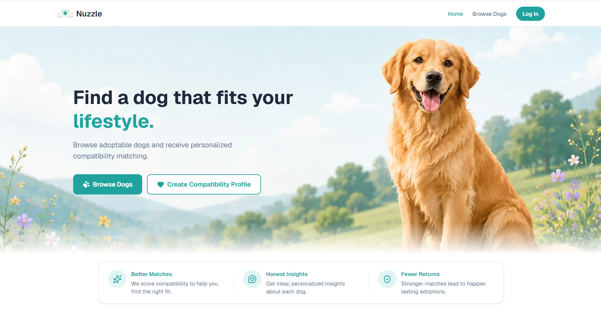

# 🐾 Nuzzle

**Find a dog that fits your lifestyle.**

Nuzzle is a dog-adoption **compatibility and decision-support** platform. Instead of being just another
place to scroll through adoptable dogs, it scores how well each dog actually fits your household and
lifestyle — with transparent reasoning and an honest confidence signal — to help people make better
adoption decisions and reduce return rates.

### ▶️ Live app: **[www.nuzzledogadoption.us](https://www.nuzzledogadoption.us)**

<!-- Tip: drop a screenshot of the live app here, e.g.  -->


---

## Features

- **Browse before you sign up** — anonymous, friction-free browsing of live adoptable dogs.
- **Two-phase questionnaire** — a required *Quick Match* (6 questions) plus an optional *Improve
  Accuracy* phase (8 more questions) that sharpens matches and raises confidence.
- **Deterministic compatibility engine** — a pure, 100-point scoring function (household safety, energy,
  experience, size, age, sex, grooming, and more) with a separate **confidence score** that
  communicates uncertainty when shelter data is missing.
- **Catalog-wide best matches** — for a profiled user, Nuzzle ranks a large candidate pool of dogs
  (not just the first page) so two different people genuinely see different top matches.
- **AI explanations** — short, natural-language "why this dog fits" summaries generated by Groq
  **after** scoring. AI never calculates or changes a score.
- **Favorites & dashboard**, **shelter redirects**, and a **mobile-first, accessible** UI.

## Tech stack

| Layer | Technology |
|-------|-----------|
| Framework | Next.js (App Router, Turbopack) |
| Language | TypeScript (strict) |
| Database | PostgreSQL (Neon) via Prisma |
| Auth | Clerk |
| Styling | Tailwind CSS |
| Dog data | RescueGroups v5 API |
| AI | Groq (`llama-3.3-70b-versatile`) — explanations only |
| Testing | Vitest + React Testing Library + Playwright |
| Hosting | Vercel |

## Architecture at a glance

```
RescueGroups API → Provider layer → Normalization → Compatibility engine → Explanation layer → UI
```

- **The compatibility engine is pure and deterministic** — no DB, API, AI, or side effects inside it.
  Same input → same output, always. This is what makes matches trustworthy and testable.
- **AI is isolated** — explanations are generated only after a score exists and are stored separately;
  they never feed back into scoring.
- **Best-match ranking uses a cached candidate pool** — a large, user-independent pool of dogs is
  fetched and cached (`unstable_cache`), then scored per-request against the signed-in user's live
  profile, so results reflect the catalog rather than one arbitrary page.

Deeper detail: [architecture overview](docs/architecture/architecture.md) ·
[compatibility engine spec](docs/architecture/compatibility-engine-spec.md) ·
[database & API contract](docs/architecture/database-api-contract.md).

## Getting started

### Prerequisites

- **Node.js 24.15.0** (see [`.nvmrc`](.nvmrc); use [nvm](https://github.com/nvm-sh/nvm) or
  [fnm](https://github.com/Schniz/fnm) to match it)
- A **Neon** (or any PostgreSQL) database URL
- A **Clerk** application (development keys)
- **RescueGroups** and **Groq** API keys

### Setup

```bash
# 1. Install dependencies (also runs `prisma generate`)
npm install

# 2. Create your local env file and fill in the values
cp .env.example .env

# 3. Apply the database schema
npx prisma migrate deploy

# 4. Start the dev server
npm run dev
```

Open **[http://localhost:3000](http://localhost:3000)**.

### Environment variables

Copy [`.env.example`](.env.example) to `.env` and fill in:

| Variable | Purpose |
|----------|---------|
| `DATABASE_URL` | Neon/PostgreSQL connection string |
| `RESCUEGROUPS_API_KEY` | RescueGroups v5 API key (dog data) |
| `GROQ_API_KEY` | Groq API key (AI explanations only — never scoring) |
| `CLERK_SECRET_KEY` | Clerk backend secret |
| `NEXT_PUBLIC_CLERK_PUBLISHABLE_KEY` | Clerk frontend publishable key |
| `NEXT_PUBLIC_CLERK_SIGN_IN_URL` / `..._SIGN_UP_URL` | Custom auth routes (`/login`, `/signup`) |
| `NEXT_PUBLIC_CLERK_AFTER_SIGN_IN_URL` / `..._AFTER_SIGN_UP_URL` | Post-auth redirects (`/search`, `/questionnaire`) |

> **Clerk dev vs. production:** use development keys (`pk_test_`/`sk_test_`) locally. Production needs a
> Clerk **production instance** with your own verified email domain (DNS/DKIM) — dev instances send
> verification emails from a shared sender that often lands in spam. See
> [docs/ops/clerk-production-setup.md](docs/ops/clerk-production-setup.md).

## Scripts

| Command | Description |
|---------|-------------|
| `npm run dev` | Start the dev server (http://localhost:3000) |
| `npm run build` | Production build |
| `npm run start` | Serve the production build |
| `npm run lint` | Lint with ESLint |
| `npm run typecheck` | Type-check with `tsc --noEmit` |
| `npm run test` | Run the unit/integration suite (Vitest) |
| `npm run test:watch` | Vitest in watch mode |
| `npm run test:e2e` | Run Playwright end-to-end tests |
| `npm run format` / `format:check` | Prettier write / check |

## Testing & TDD

Nuzzle is built with **spec-driven, test-first development**: tests are written before the
implementation, watched fail (red), then made to pass (green), with red/green test-runner screenshots
captured via [`docs/tdd-screenshots/_src/capture.mjs`](docs/tdd-screenshots/_src). The compatibility
engine carries full coverage of its scoring and confidence cases.

The conventions live in [RULES.md](RULES.md) and [AGENTS.md](AGENTS.md), and the enumerated cases in
[docs/product/user-stories-tdd-plan.md](docs/product/user-stories-tdd-plan.md).

## Project structure

```
app/            Next.js routes + API (search, questionnaire, favorites, dogs/[…], login, signup, api/)
components/     UI components (DogCard, SearchResults, layout/ …)
lib/
  compatibility/  Deterministic engine, normalization, types, display helpers
  rescuegroups/   RescueGroups v5 API client + types
  search/         Candidate-pool ranking + card adapters
  ai/             Groq explanation generation (post-scoring only)
  auth/  db/  homepage/  questionnaire/  providers/  analytics/
prisma/         Prisma schema + migrations
__tests__/      Vitest unit/integration tests
e2e/            Playwright end-to-end tests
docs/           Architecture, product, UX, ops, and TDD documentation
proxy.ts        Clerk middleware
```

## Documentation

- **Product:** [PRD](docs/product/prd.md) · [user stories & TDD plan](docs/product/user-stories-tdd-plan.md)
- **Architecture:** [overview](docs/architecture/architecture.md) ·
  [compatibility engine spec](docs/architecture/compatibility-engine-spec.md) ·
  [database & API contract](docs/architecture/database-api-contract.md)
- **UX:** [UX spec](docs/ux/ux-spec.md) · [visual design reference](docs/ux/visual-design-reference.md)
- **Ops:** [Clerk production setup](docs/ops/clerk-production-setup.md)

## Deployment

Deployed on **Vercel** at [www.nuzzledogadoption.us](https://www.nuzzledogadoption.us). Secrets are set
as host environment variables (never committed); production uses live Clerk keys and a Clerk production
instance (see the ops doc above).

## Acknowledgements

Adoptable-pet data is provided by the [RescueGroups.org API](https://rescuegroups.org/).
