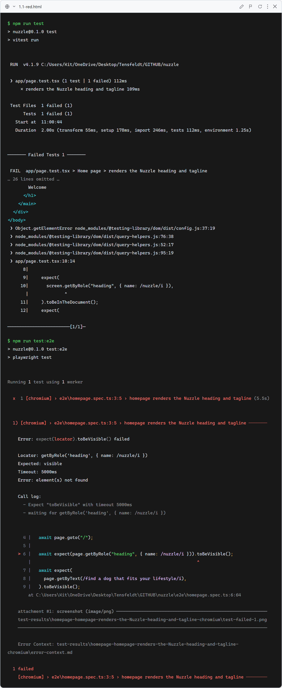
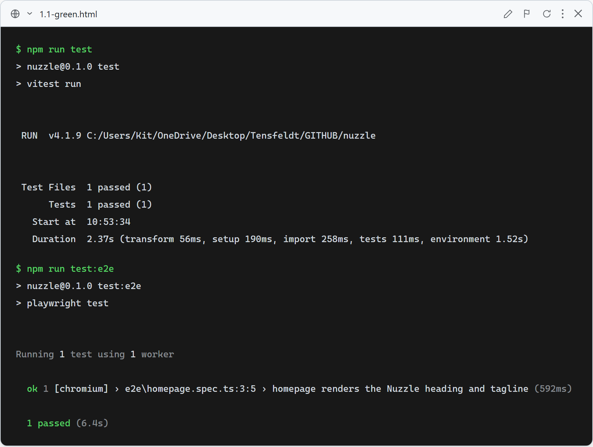

# Story 1.1: Initialize Application

## 1.1-SMOKE: Homepage renders Nuzzle heading and tagline

**What this test verifies:** The app starts and the homepage renders an `<h1>` heading containing "Nuzzle" and the tagline "Find a dog that fits your lifestyle." Verified both as a component test (Vitest + React Testing Library, `app/page.test.tsx`) and as a browser-level E2E test (Playwright, `e2e/homepage.spec.ts`).

### Red (failing — before implementation)

`app/page.tsx` rendered a generic placeholder (no "Nuzzle" heading), so both the Vitest/RTL test and the Playwright E2E test failed to find the expected heading and tagline. Screenshot is the real captured terminal output of `npm run test` and `npm run test:e2e` against that failing state, rendered via `docs/tdd-screenshots/_src/capture.mjs` (long failure output — RTL's accessibility-tree dump, Playwright's retry log — is truncated with a visible "N lines omitted" marker so the screenshot stays readable; nothing is rewritten or fabricated).

### Green (passing — after implementation)

`app/page.tsx` was replaced with minimal Nuzzle placeholder content; both the Vitest/RTL test (`npm run test`) and the Playwright E2E test (`npm run test:e2e`) pass. Screenshot is the real captured terminal output of both commands, rendered via `docs/tdd-screenshots/_src/capture.mjs`.

