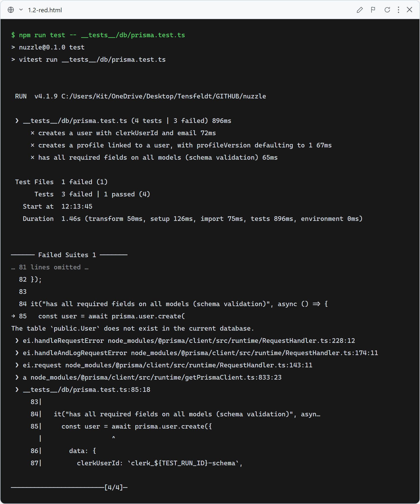
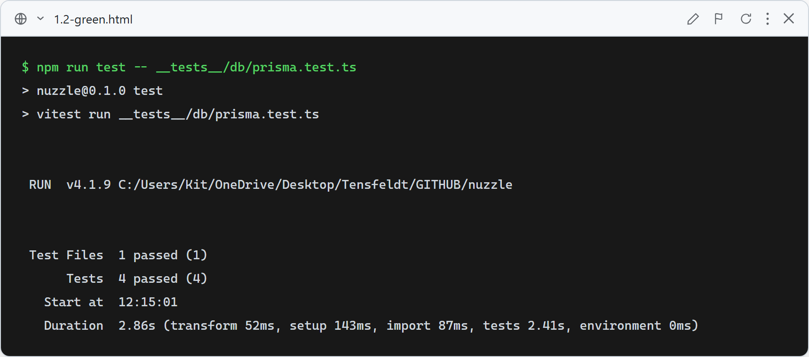

# Story 1.2: Configure Database Layer

## 1.2-DB: Database layer connects, creates records, and matches the canonical schema

**What this test verifies:** The Prisma client (`lib/db/prisma.ts`) connects to the real Neon Postgres database without throwing, a `User` can be created with `clerkUserId` and `email`, an `AdopterProfile` can be created linked to a `User` (with `profileVersion` defaulting to `1`), and every required model (`User`, `AdopterProfile`, `DogCache`, `CompatibilityScore`, `AiExplanation`, `Favorite`, `AnalyticsEvent`) accepts all required fields per `docs/architecture/database-api-contract.md`. Verified against the live Neon database (no mocking) in `__tests__/db/prisma.test.ts`.

### Red (failing — before implementation)

`prisma/schema.prisma` and the Prisma client existed and could connect (the connection test passed), but `npx prisma migrate dev` had not yet been run, so none of the tables existed in the live Neon database — `prisma.user.create()` and the cascading cleanup queries failed with real `The table 'public.User' does not exist in the current database` / `public.AiExplanation does not exist` errors. Screenshot is the real captured terminal output of `npm run test -- __tests__/db/prisma.test.ts`, rendered via `docs/tdd-screenshots/_src/capture.mjs`.

### Green (passing — after implementation)

`npx prisma migrate dev --name init` ran against the live Neon database, creating all 7 tables from the canonical schema. All four test cases in `__tests__/db/prisma.test.ts` pass against the live database. Screenshot is the real captured terminal output of `npm run test -- __tests__/db/prisma.test.ts`, rendered via `docs/tdd-screenshots/_src/capture.mjs`.

