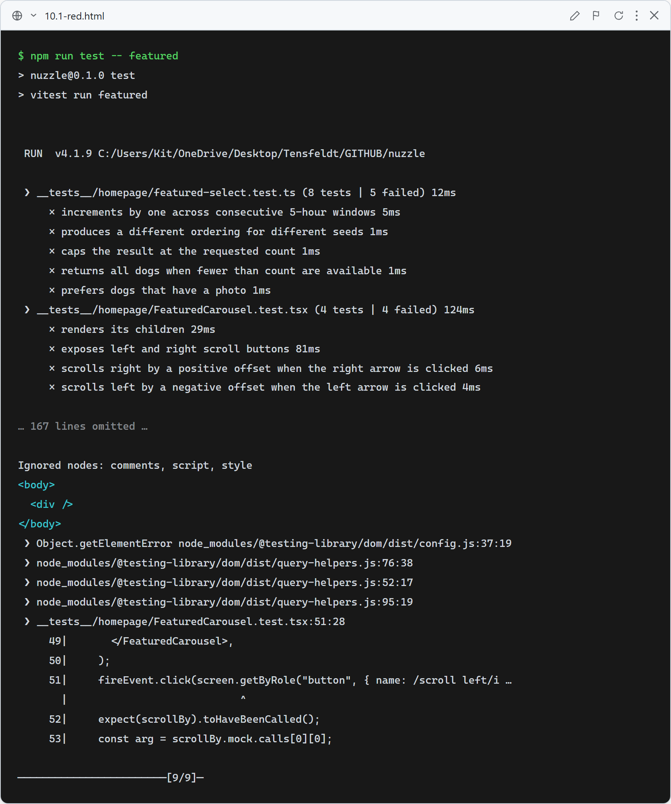
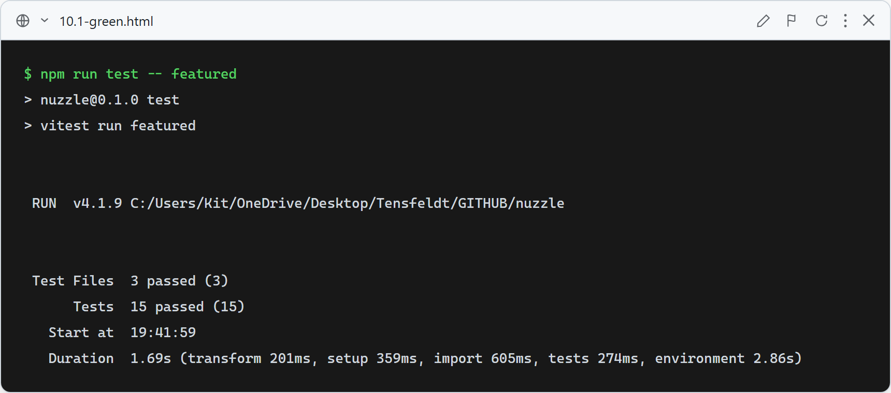

# 10.1: Featured Dogs — 8 nationwide random dogs (5-hour rotation) + working scroll arrows

**What this verifies:** the homepage Featured Dogs row shows up to 8 dogs drawn from a **nationwide** pool that rotate every ~5 hours, and the left/right arrows actually scroll the row.

- `featuredWindowSeed(now)` is stable within a 5-hour window and increments by one when the window flips (drives the rotation cadence + ISR `revalidate = 18000` on the homepage).
- `seededShuffle` is deterministic per seed and never mutates its input.
- `pickFeatured(dogs, seed, count)` is deterministic per seed, differs across seeds, caps at `count`, prefers dogs with a photo, and returns all when fewer than `count` exist.
- `FeaturedCarousel` renders its (server-rendered) children, exposes "Scroll left"/"Scroll right" buttons, and calls `scrollBy` with a positive offset on right-click and a negative offset on left-click.

### Red (failing — before implementation)

Stubs in place (`featuredWindowSeed`→0, `pickFeatured`→[], `FeaturedCarousel`→null): 9 failed / 3 passed — real assertion failures (rotation increment, deterministic/photo-preferring picks, carousel children + arrow scroll), not import errors.

### Green (passing — after implementation)

mulberry32-seeded shuffle + window seed + photo-preferring pick implemented; `FeaturedCarousel` owns the scroll ref and arrow buttons; `FeaturedDogs` fetches nationwide with a seed-derived page and picks 8. All 15 featured tests pass; existing `FeaturedDogs` link/fallback tests stay green.
