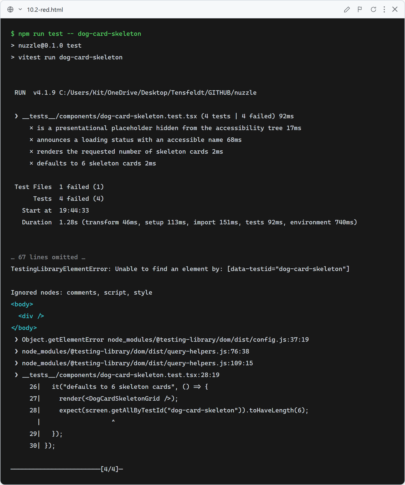
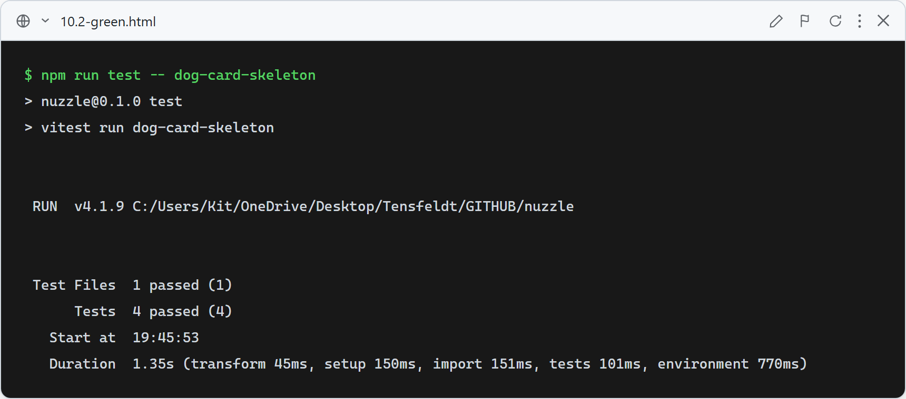

# 10.2: Loading skeletons for dog lists

**What this verifies:** dog lists show animated card skeletons while loading instead of a bare line / blank page.

- `DogCardSkeleton` renders a presentational placeholder (`data-testid="dog-card-skeleton"`, `aria-hidden`) that mirrors the DogCard shell.
- `DogCardSkeletonGrid` carries a `role="status"` with an accessible name (`/loading/i`) for screen readers (Rule 13) and renders `count` skeleton cards (default 6).

Applied at: `app/search/SearchPageClient.tsx` loading state (covers search **and** matches `?source=questionnaire`), plus route-level `app/favorites/loading.tsx` and `app/dogs/[provider]/[externalId]/loading.tsx`.

### Red (failing — before implementation)

Stub components return `null`: 4 failed — missing skeleton testid, missing `role="status"` loading name, wrong card counts.

### Green (passing — after implementation)

Skeleton + grid implemented and wired into the search loading state and the favorites/detail route loaders. All 4 skeleton tests pass; full suite green.
