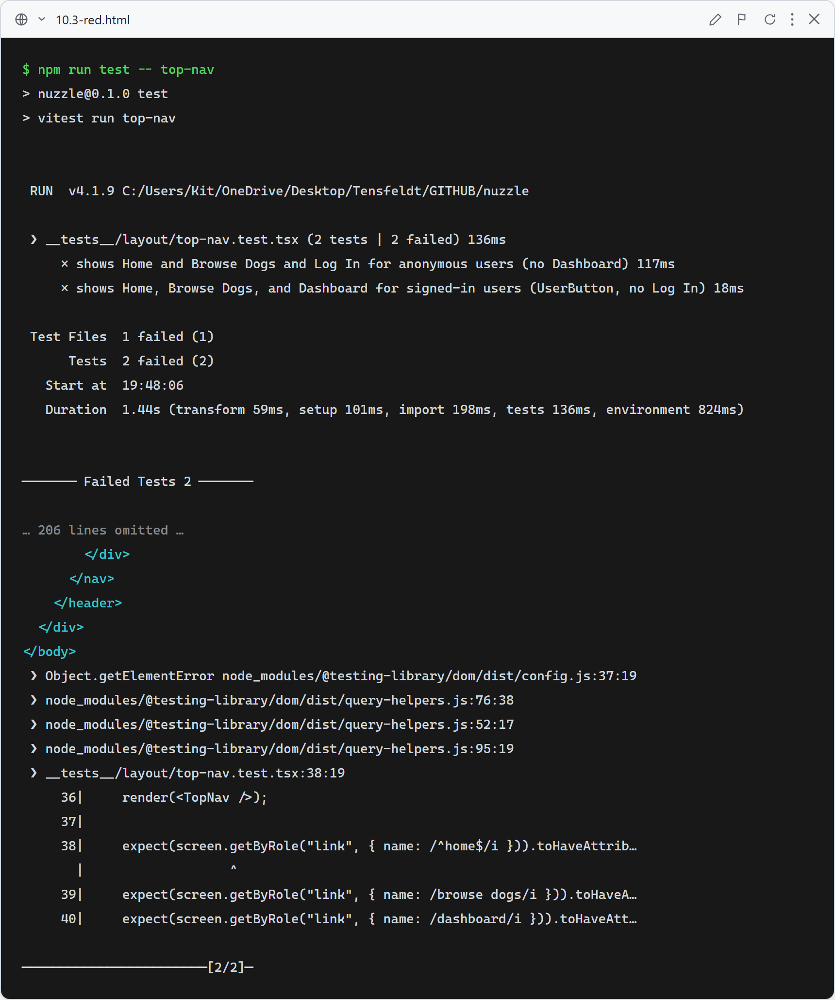
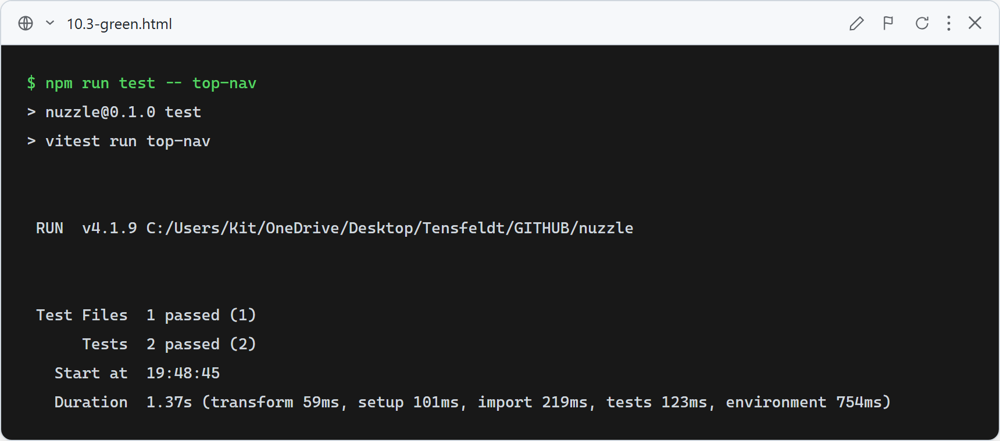

# 10.3: Navbar links — Home (always) + Dashboard (authenticated)

**What this verifies:** the desktop top nav now exposes Home and a Dashboard link for signed-in users.

- Anonymous → **Home** (`/`), **Browse Dogs** (`/search`), and **Log In**; **no** Dashboard link.
- Signed in → **Home**, **Browse Dogs**, **Dashboard** (`/favorites`, the saved-dogs dashboard), and the Clerk `UserButton`; **no** Log In.

Active link styling is derived from `usePathname()`. Mobile continues to use `BottomTabBar`.

### Red (failing — before implementation)

Old TopNav only had Browse Dogs + Log In/UserButton: 2 failed — no Home link, no Dashboard link.

### Green (passing — after implementation)

TopNav adds Home (always) + Dashboard (auth-only) with active styling. Both tests pass; full suite green.
