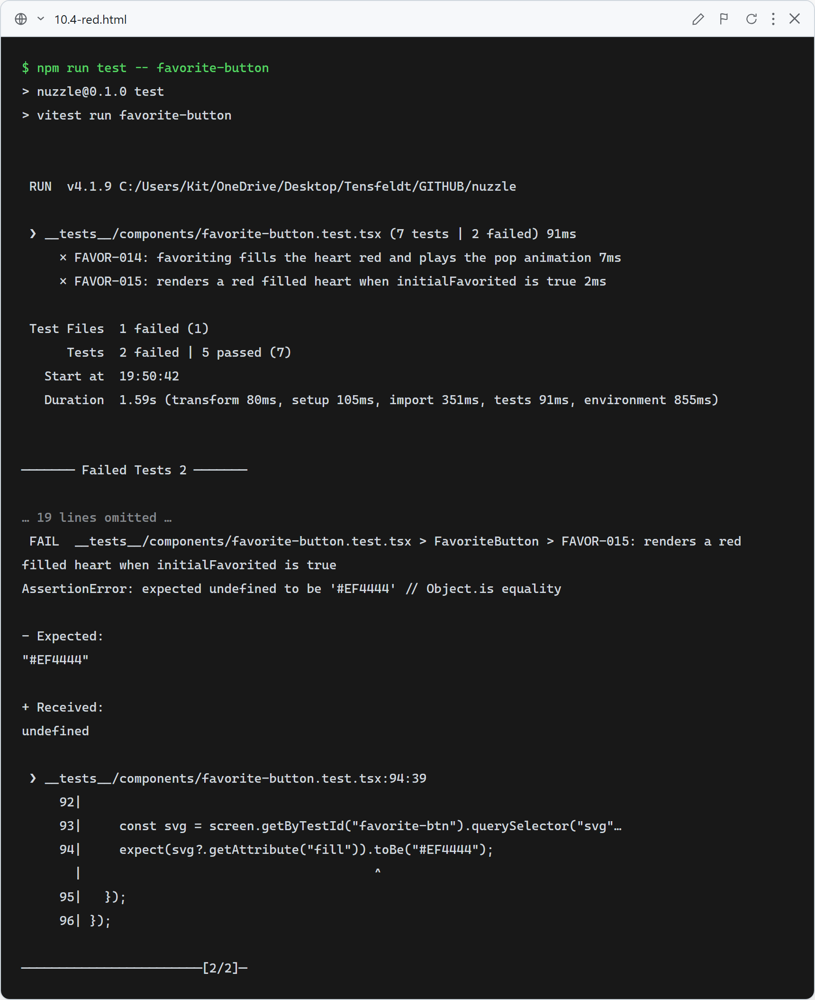
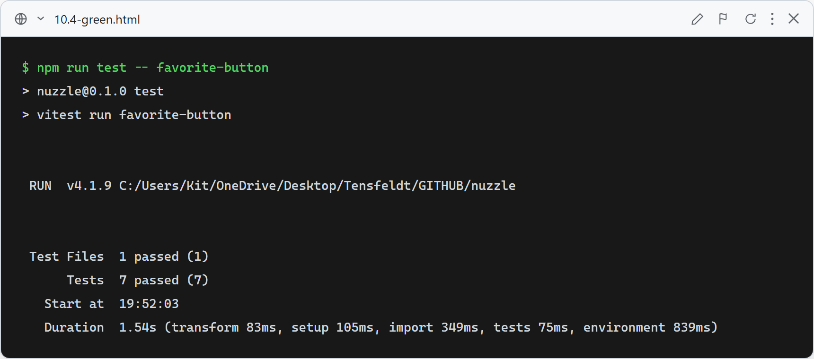

# 10.4: Larger favorite heart with fill-red pop animation

**What this verifies:** the favorite control is a larger lucide `Heart` that pops and fills **red** when favorited, and stays red as the persistent favorited state.

- FAVOR-014: clicking to favorite (signed in) fills the heart red (`svg fill="#EF4444"`) and applies the `animate-heart-pop` class.
- FAVOR-015: a button mounted with `initialFavorited` shows the red filled heart immediately.
- Unfavorited state stays an outline heart (`fill="none"`, stroke = `currentColor`).
- Existing FAVOR-009…013 (testid, `aria-pressed`, login-prompt, POST/DELETE, no fetch when anonymous) remain green.

The pop keyframe lives in `app/globals.css` and is disabled under `prefers-reduced-motion` (Rule 13); color is paired with `aria-pressed`, never color-only.

### Red (failing — before implementation)

Old `♥/♡` glyph button has no `svg`: FAVOR-014/015 fail (no red fill / no pop class); the 5 behavior tests still pass.

### Green (passing — after implementation)

`FavoriteButton` renders a lucide `Heart` (size 22 on cards, 26 on detail), red-filled + pop on favorite. All 7 favorite-button tests pass; full suite green.
