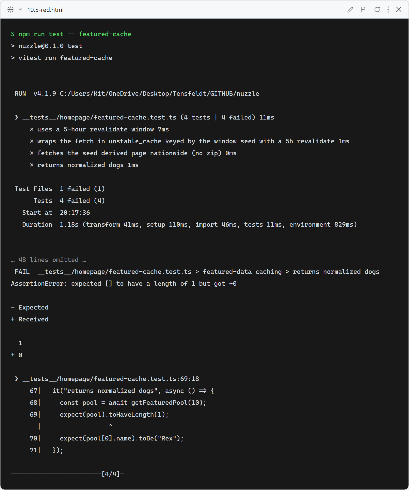
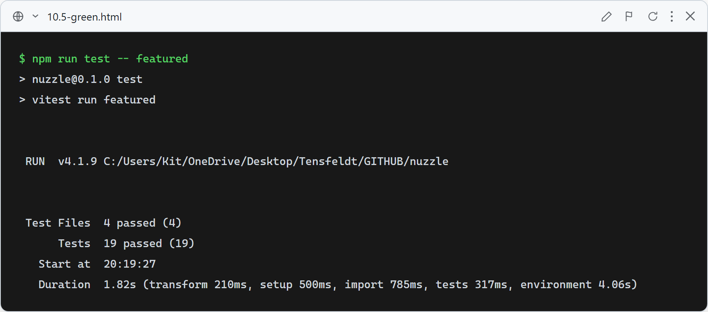

# 10.5: Cache the Featured Dogs fetch (~5 hours)

**What this verifies:** the RescueGroups call behind Featured Dogs is cached at the data layer, so it runs at most once per 5-hour rotation window — independent of whether the homepage renders statically or dynamically.

Why this is needed: RescueGroups search is a **POST**, which Next's data cache never caches; the homepage's `export const revalidate` only helps if the route renders statically (and Clerk's provider could flip it dynamic). `getFeaturedPool` wraps the fetch in `unstable_cache` keyed by the window seed with `revalidate: 18000`, guaranteeing ≤1 provider call per window (Rule 16).

- `FEATURED_REVALIDATE_SECONDS === 18000` (5 hours).
- `getFeaturedPool(seed)` calls `unstable_cache` with a cache key containing the seed and `revalidate: 18000`.
- It fetches the seed-derived page nationwide (no zip): `searchRescueGroupsDogs({ page: (seed % 8) + 1, limit: 40 })`.
- Returns normalized dogs.

### Red (failing — before implementation)

Stub `featured-data.ts` (`getFeaturedPool → []`, `FEATURED_REVALIDATE_SECONDS = 0`, no `unstable_cache` call): 4 failed — wrong revalidate, cache not wired, fetch not made.

### Green (passing — after implementation)

`getFeaturedPool` caches the nationwide pool via `unstable_cache` (seed-keyed, 5h revalidate); `FeaturedDogs` consumes it. All 19 featured tests pass (incl. the existing FeaturedDogs link/fallback tests, with `next/cache` mocked as a passthrough); full suite green.
