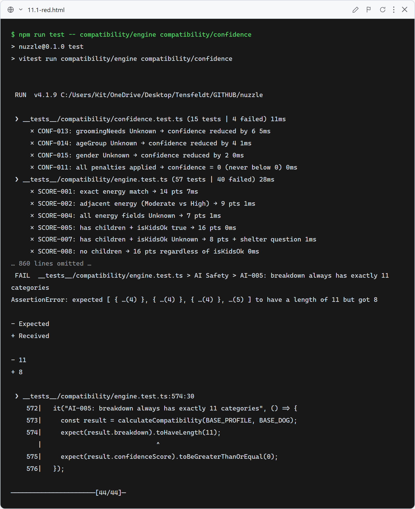
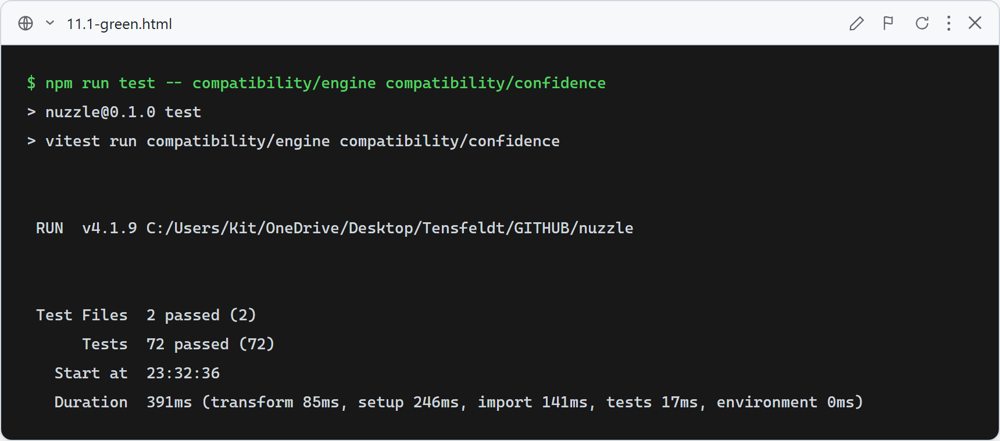

# 11.1: Compatibility engine rebalance — Age, Sex, Grooming scored

**What this verifies:** the engine's 100-point model was rebalanced to add three new scored categories — **Age Preference (7)**, **Grooming Fit (4)**, **Sex Preference (2)** — while keeping the total at 100 (the original eight were reduced proportionally). New confidence penalties were added for `ageGroup` (−4), `gender` (−2), and `groomingNeeds` (−6).

- Every existing `SCORE-*`/`CONF-*` expectation updated to the new weights.
- New `SCORE-AGE-001…005`, `SCORE-SEX-001…004`, `SCORE-GROOM-001…005`, `CONF-013/014/015`.
- `AI-005` now asserts the breakdown has 11 categories; `SCORE-034` (all best-fit) still totals 100.

### Red (failing — before implementation)

Tests reflect the new spec/weights; the old engine fails 44/72 (old point values, only 8 categories).

### Green (passing — after implementation)

Rebalanced engine implemented (Age/Grooming/Sex categories + confidence penalties). 72/72 engine+confidence pass; full suite green (245), including the ranking tests (relative ordering preserved).
