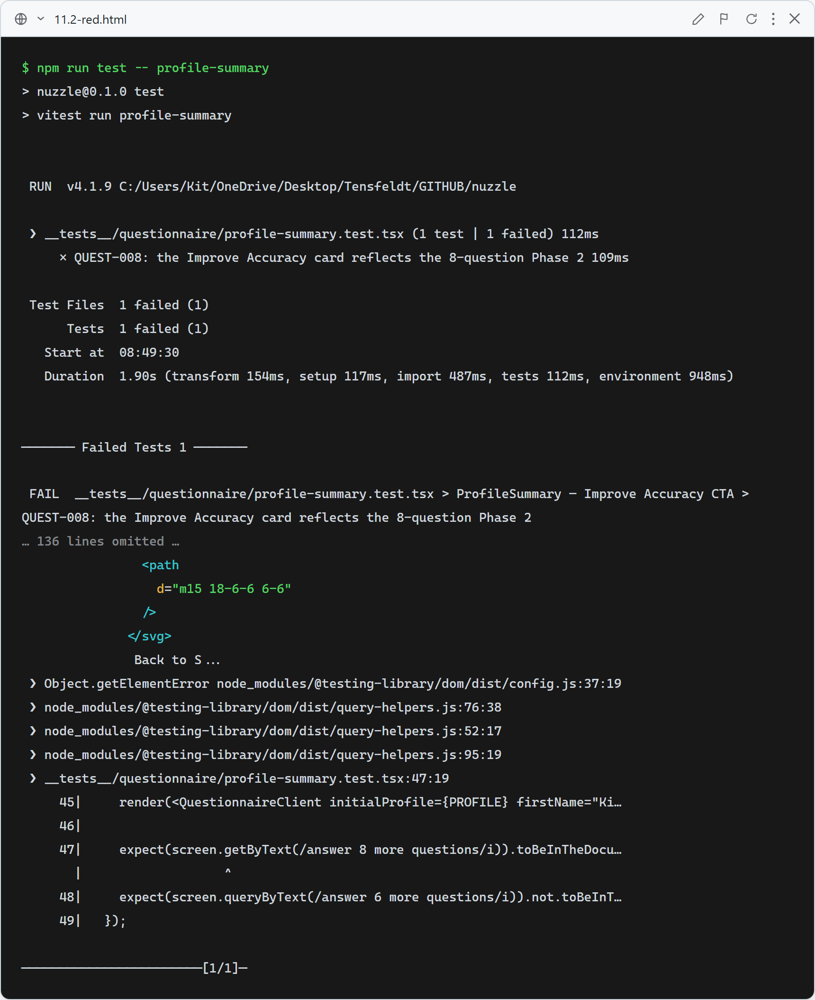
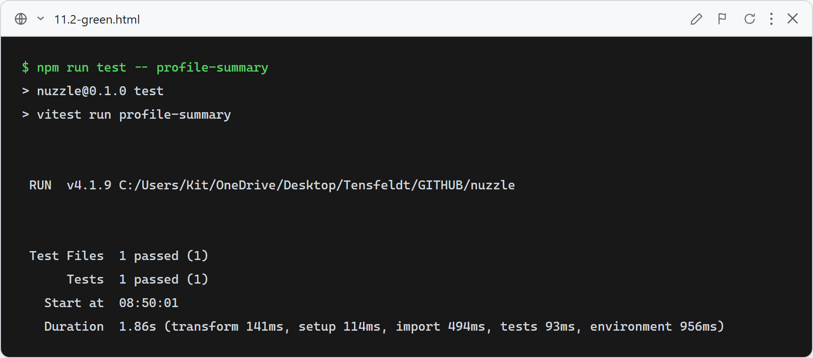

# 11.2: Profile "Improve Accuracy" CTA reflects the 8-question Phase 2

**What this verifies:** the dashboard/profile "Improve Accuracy" card copy matches the redesigned Phase 2, which now has **8** questions (it previously said "Answer 6 more questions" — stale after Story 4 added Age, Sex, Grooming, and Hours-alone and combined the yard question).

- New `__tests__/questionnaire/profile-summary.test.tsx` renders `QuestionnaireClient` with a complete saved profile (drops it into edit mode → `ProfileSummary`).
- `QUEST-008` asserts the Improve Accuracy card shows "Answer 8 more questions" and **not** "6 more".

### Red (failing — before implementation)

The card still rendered "Answer 6 more questions", so `getByText(/answer 8 more questions/i)` fails (real assertion failure — the component renders, the sidebar shows "Welcome back, Kit").

### Green (passing — after implementation)

Copy updated to "Answer 8 more questions to improve your matches" ([QuestionnaireClient.tsx:1176](../../app/questionnaire/QuestionnaireClient.tsx)). 1/1 passes.
