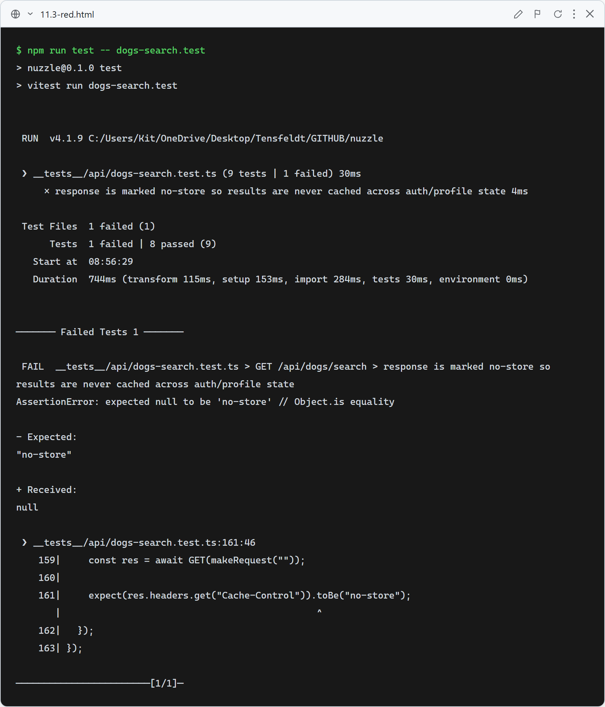

# 11.3: Search results must not be cached across sessions

**What this verifies:** `/api/dogs/search` results depend on the signed-in user's profile (scores + best-match order), so the response must never be cached or shared across sessions. Before this fix the GET returned JSON with no `Cache-Control`, so the browser could serve a logged-in user's response to a guest, and a profiled user could keep seeing stale scores after editing their questionnaire.

**Fix:**
- **Server** ([app/api/dogs/search/route.ts](../../app/api/dogs/search/route.ts)): `export const dynamic = "force-dynamic"` + response header `Cache-Control: no-store`.
- **Client** ([app/search/SearchPageClient.tsx](../../app/search/SearchPageClient.tsx)): fetch with `{ cache: "no-store" }` and re-fetch when `isSignedIn` flips (in-place login/logout), clearing the page cache.

**Tests:**
- `__tests__/api/dogs-search.test.ts` — the response sets `Cache-Control: no-store` (the cycle shown below).
- `__tests__/search/search-caching.test.tsx` — `CACHE-001` (fetch uses `cache: no-store`) and `CACHE-002` (results re-fetch on in-place logout).

### Red (failing — before implementation)

Route returned no cache header → `expected null to be 'no-store'`.

### Green (passing — after implementation)

`no-store` header set; route test 9/9. The client `search-caching` tests (cache option + logout re-fetch) also pass; full suite green.
