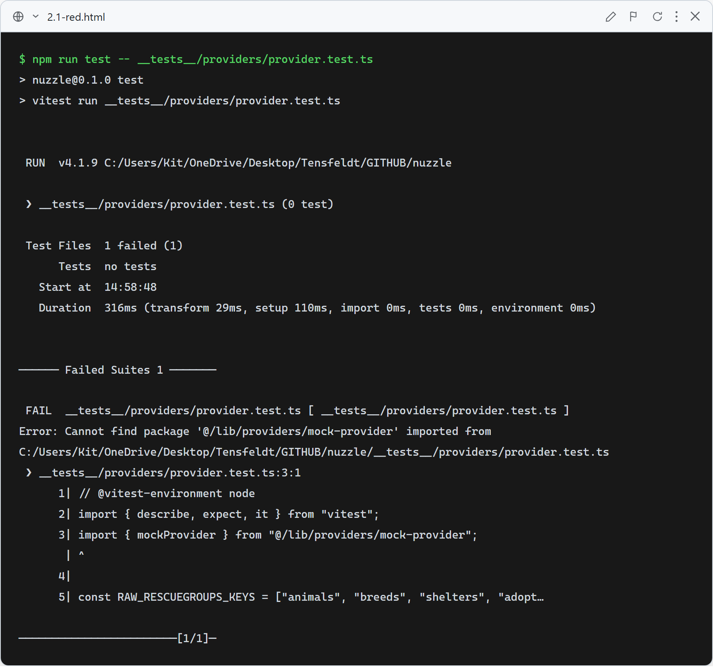
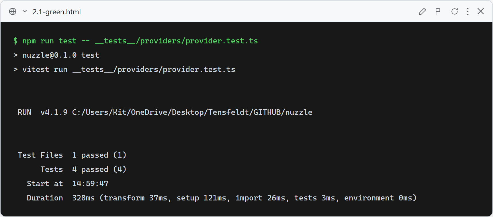

# Story 2.1: Create Provider Interface

## 2.1-Provider: PetProvider interface satisfies contract, mock returns valid NormalizedDog, no raw RescueGroups fields leak

**What this test verifies:** The `PetProvider` interface (`lib/providers/types.ts`) is implemented by `mockProvider` (`lib/providers/mock-provider.ts`); `searchDogs` returns an array of correctly-shaped `NormalizedDog` objects; `getDogById` returns a matching dog or `null`; and returned objects contain none of the raw RescueGroups API field names (`animals`, `breeds`, `shelters`, `adoptionUrl`). Verified in `__tests__/providers/provider.test.ts` with no mocking of the mock provider itself.

### Red (failing — before implementation)

The test file imported `mockProvider` from `@/lib/providers/mock-provider` before any of the provider or types files existed. Vitest failed immediately with `Cannot find package '@/lib/providers/mock-provider'` — the correct red failure: the code we want to test does not exist yet. Screenshot is real captured terminal output via `docs/tdd-screenshots/_src/capture.mjs`.

### Green (passing — after implementation)

`lib/compatibility/types.ts`, `lib/providers/types.ts`, and `lib/providers/mock-provider.ts` were created with types verbatim from the spec docs. All 4 tests pass: searchDogs shape, getDogById found, getDogById not found, and the no-raw-RG-fields boundary check. Screenshot is real captured terminal output via `docs/tdd-screenshots/_src/capture.mjs`.

