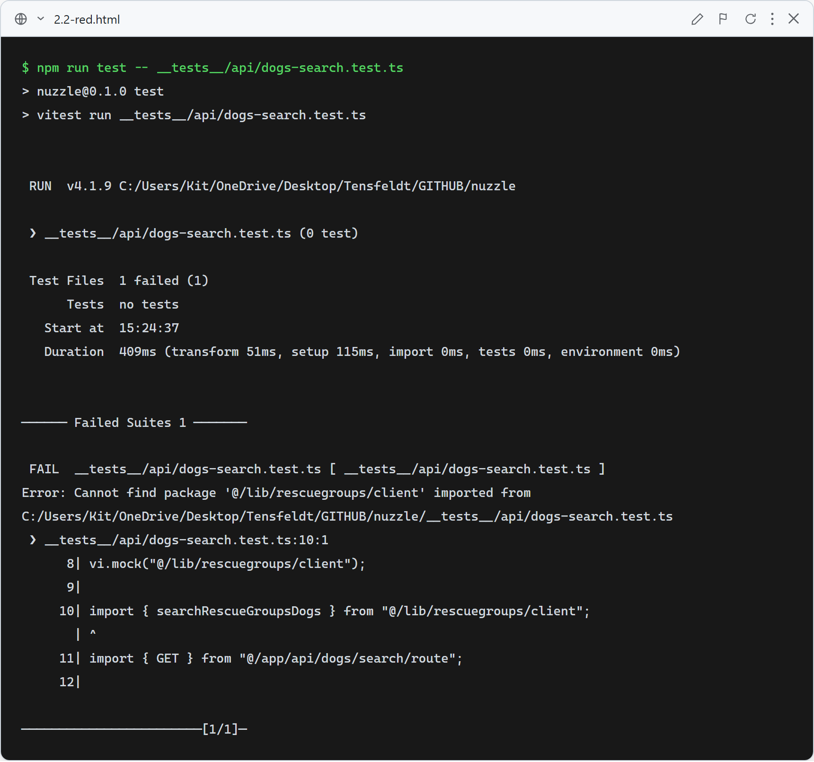
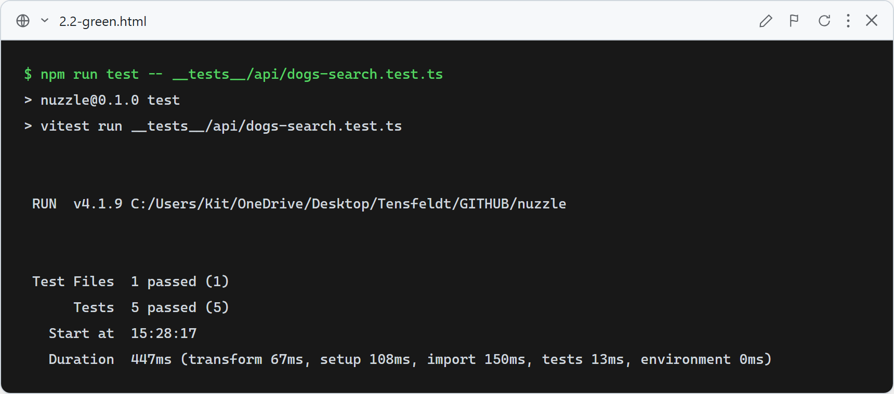

# Story 2.2 — RescueGroups Search

## Red

Tests written before implementation. All 5 failed with `Cannot find module '@/app/api/dogs/search/route'`.

## Green

`lib/rescuegroups/client.ts` fetches the RescueGroups v5 API and maps JSON:API resources to `RescueGroupsRawDog`. `app/api/dogs/search/route.ts` calls the client, normalizes via `normalizeRescueGroupsDog`, and returns the anonymous response shape with a `compatibility.available: false` teaser.

All 5 tests pass.

