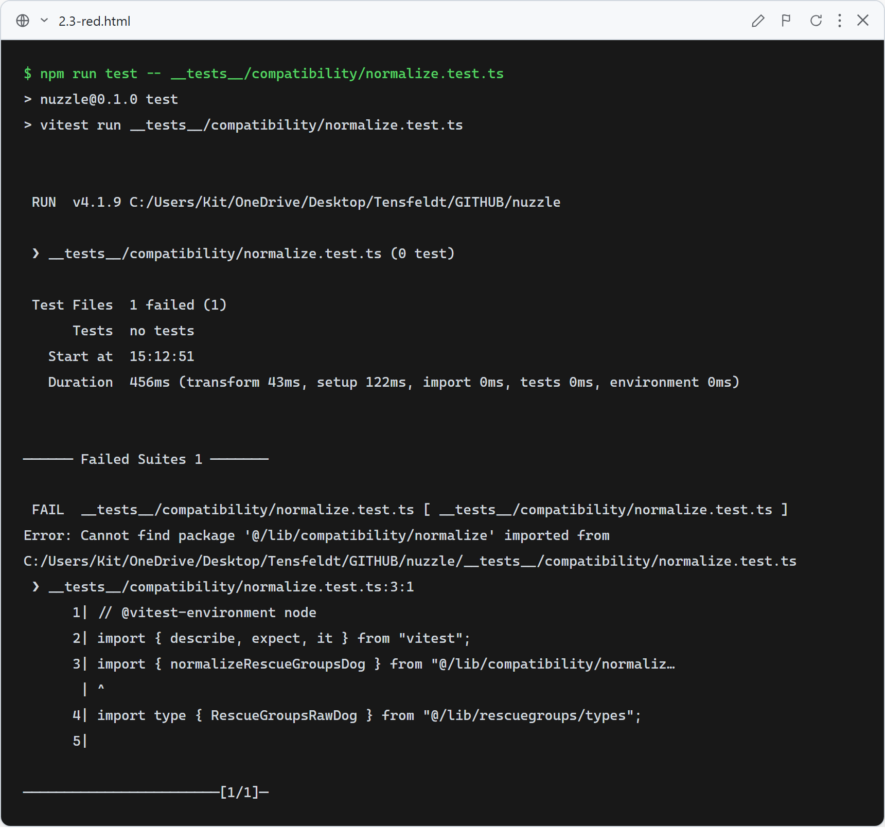
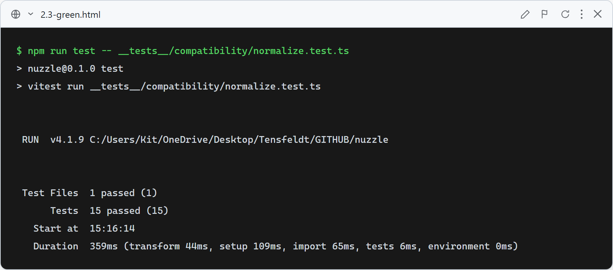

# Story 2.3: Data Normalization

## 2.3-Normalize: RescueGroups raw data maps to NormalizedDog with "Unknown" rules enforced

**What this test verifies:** `normalizeRescueGroupsDog` in `lib/compatibility/normalize.ts` correctly maps every field from the `RescueGroupsRawDog` input type to `NormalizedDog`. Domain fields (`isKidsOk`, `ageGroup`, `sizeGroup`, `fenceNeeds`, etc.) that are absent, `null`, or unrecognized become the string `"Unknown"` — never `false`, `null`, or `0` (RULES.md Rule 7). Metadata fields (`photos`, `description`, `shelterUrl`) become `[]`, `null`, or `undefined` when absent. All 15 tests run against the real normalizer in `__tests__/compatibility/normalize.test.ts`; no mocking.

### Red (failing — before implementation)

The test file imported `normalizeRescueGroupsDog` from `@/lib/compatibility/normalize` and `RescueGroupsRawDog` from `@/lib/rescuegroups/types` before either module existed. Vitest failed immediately with `Cannot find package '@/lib/compatibility/normalize'`. Screenshot is real captured terminal output via `docs/tdd-screenshots/_src/capture.mjs`.

### Green (passing — after implementation)

`lib/rescuegroups/types.ts` defines `RescueGroupsRawDog` with all fields optional/nullable. `lib/compatibility/normalize.ts` implements `normalizeRescueGroupsDog` using Set-lookup helpers that map recognized strings to the correct enum literals and return `"Unknown"` for anything unrecognized or absent. All 15 tests pass. Screenshot is real captured terminal output via `docs/tdd-screenshots/_src/capture.mjs`.

