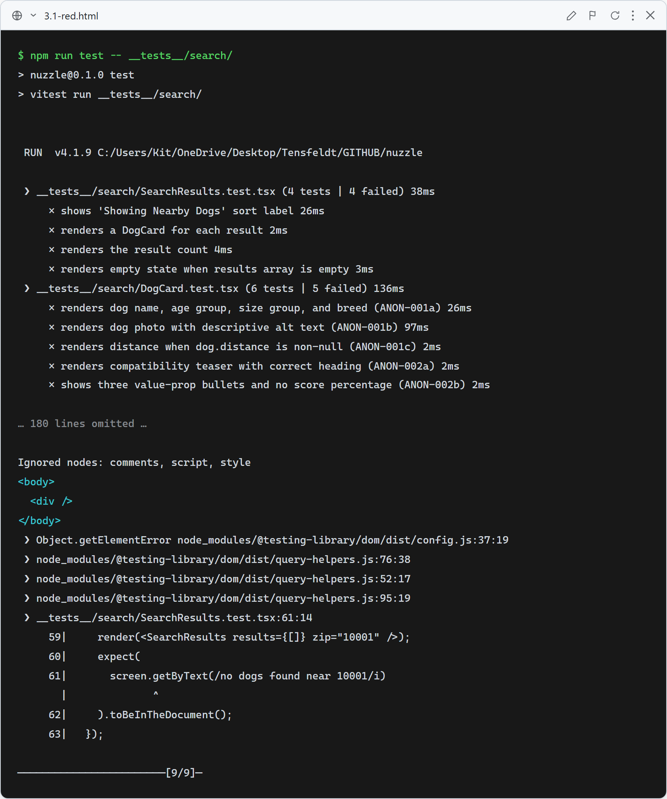
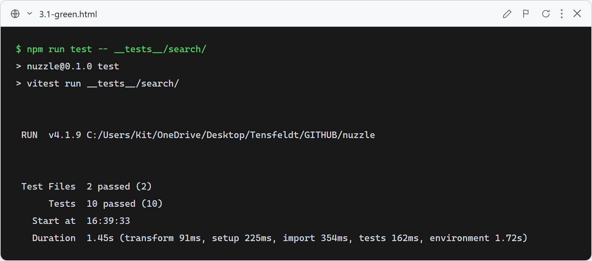

# Story 3.1 — Anonymous Search

## Red

Tests written before implementation. Both files failed with `Cannot find module` for `@/components/DogCard` and `@/components/SearchResults`.

## Green

`components/DogCard.tsx` renders dog photo, name, age/size/breed, distance (when available), and the anonymous compatibility teaser with three value-prop bullets. `components/SearchResults.tsx` renders the "Showing Nearby Dogs" sort label, result count, one card per result, and the empty state. `app/search/page.tsx` is a client component that manages ZIP input state and fetches from `GET /api/dogs/search`. The homepage `app/page.tsx` now includes a "Browse Dogs" link to `/search`.

All 10 tests pass.

