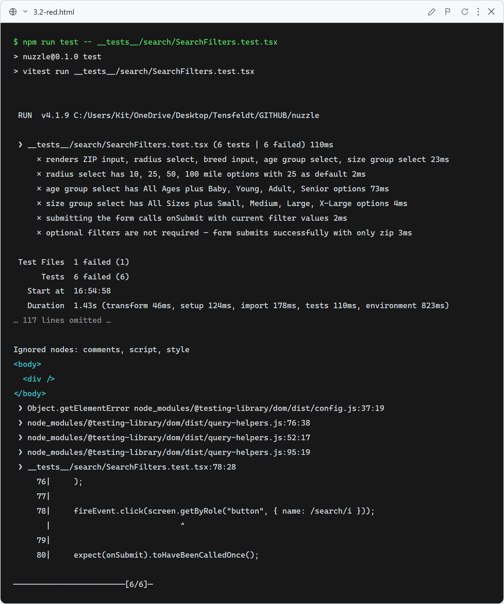
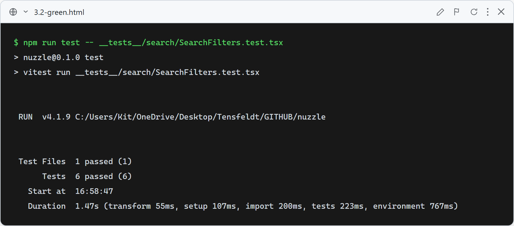

# Story 3.2 — Search Filters

## Red

Tests fail on assertions because `SearchFilters` is a stub returning `null`.

## Green

All 6 `SearchFilters` tests pass: renders all 5 controls, radius options with default, age/size group options, submit callback, and optional-fields-not-required.

