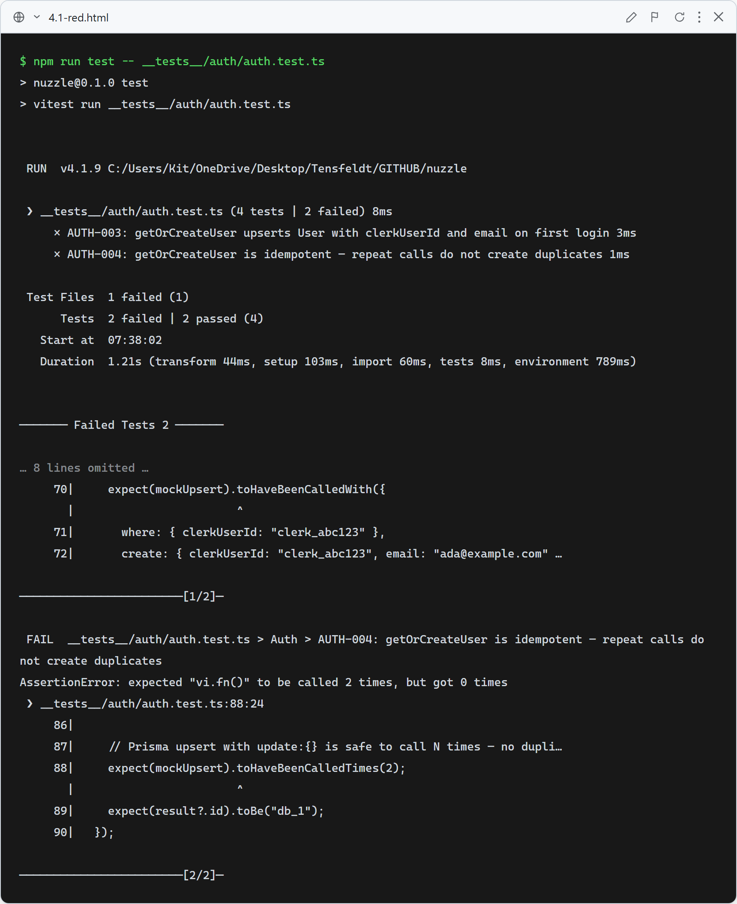
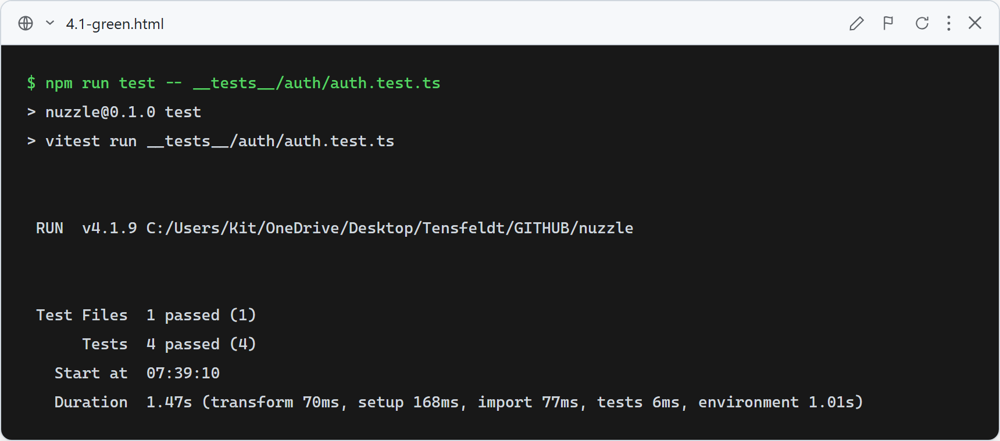

# Story 4.1 — Authentication (Clerk)

## Red

Stub `getOrCreateUser` returns null — AUTH-003 and AUTH-004 fail because `prisma.user.upsert` is never called.

## Green

All 4 auth tests pass: 401 on no session, null from unauthenticated call, correct upsert args on first login, idempotent on repeat login.

