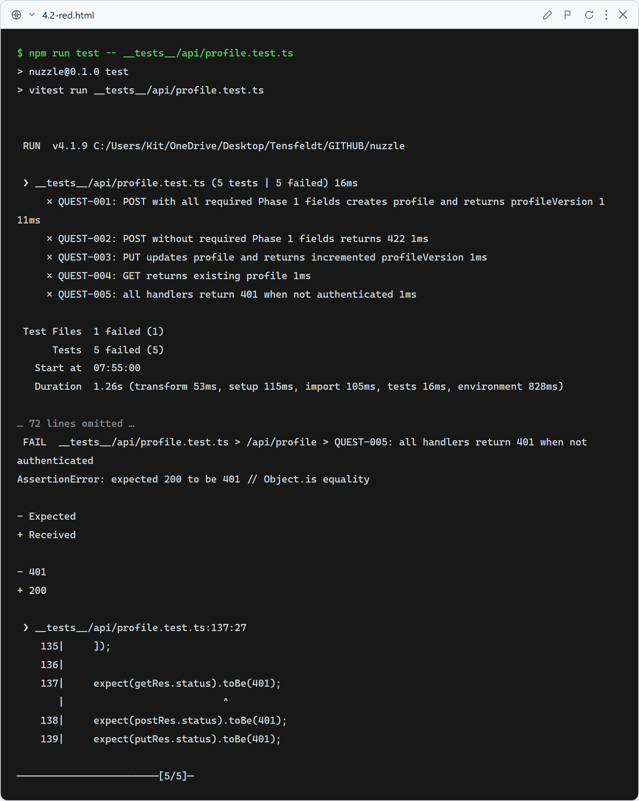
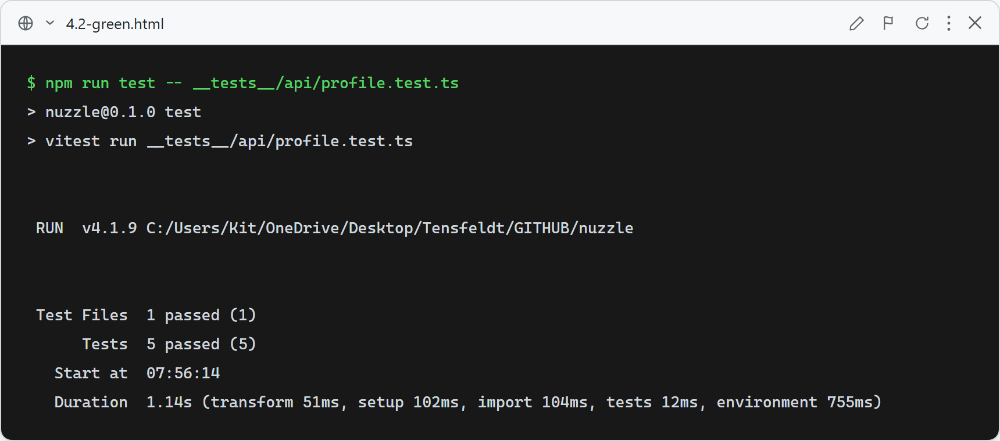

# Story 4.2 — Compatibility Questionnaire

## Red

Stub route handlers return empty 200 responses — QUEST-001 (wrong status), QUEST-002 (no 422), QUEST-003 (no increment), QUEST-004 (null body), QUEST-005 (no 401) all fail.

## Green

All 5 profile API tests pass: POST creates profile with Phase 1 fields (201), validation rejects missing fields (422), PUT increments profileVersion atomically, GET returns profile, and all handlers block unauthenticated requests (401).

