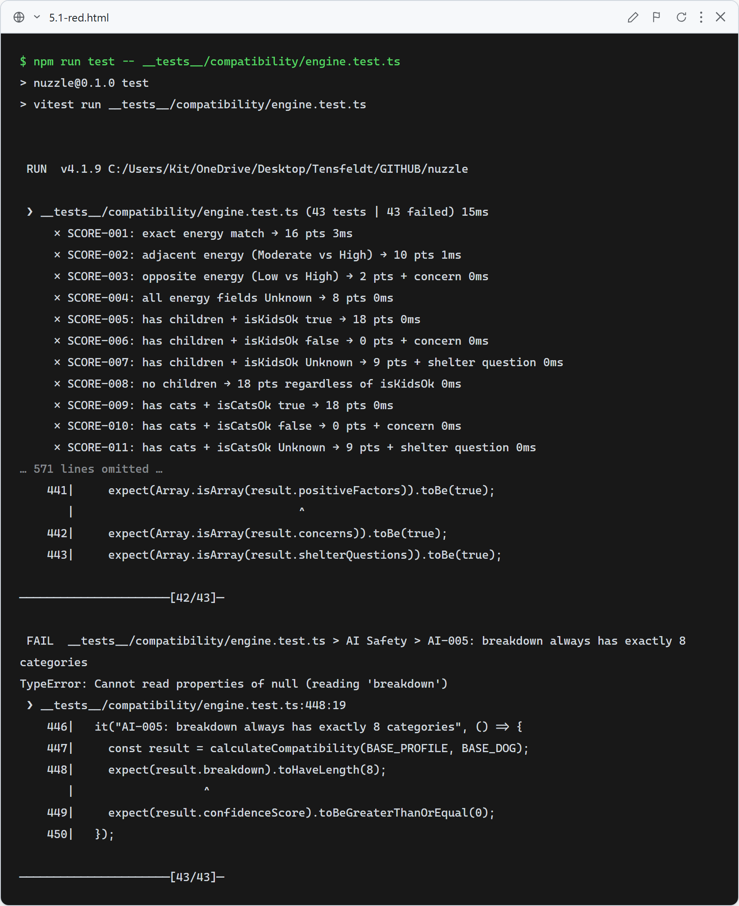
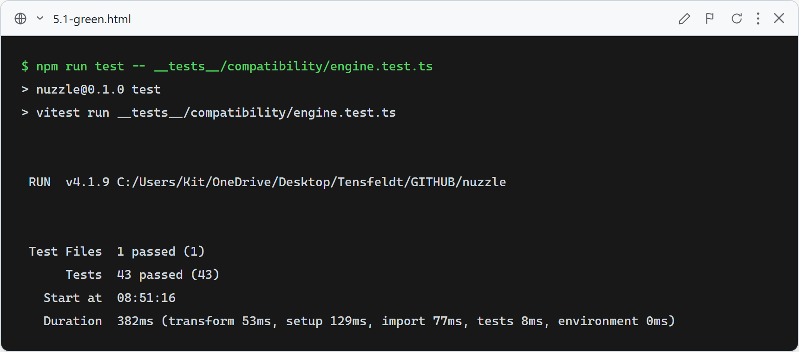

# Story 5.1 — Compatibility Engine

## Red

Stub returns `null as never` — all 43 tests fail with TypeError reading properties of null (SCORE, DET, AI tests all fail).

## Green

All 43 tests pass: 34 SCORE tests covering all 8 categories (kids/cats/dogs/energy/yard+fence/experience/size/special needs), 4 DET tests confirming determinism, and 5 AI safety tests confirming no external calls.

