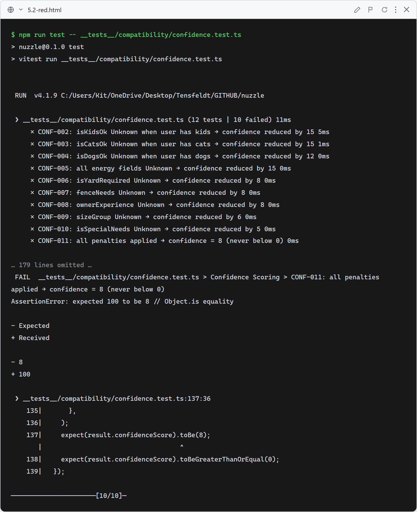
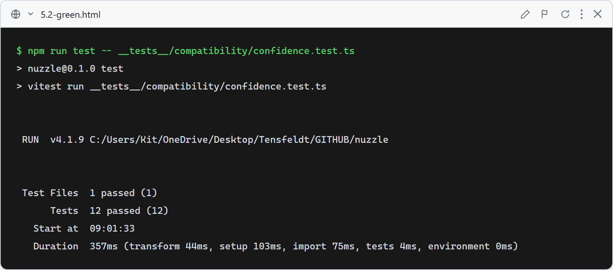

# Story 5.2 — Confidence Engine

## Red

Confidence calculation temporarily overridden to always return 100 — CONF-002 through CONF-011 all fail because expected penalty-reduced values (85/88/92/94/95/8) do not match the stubbed 100.

## Green

All 12 confidence tests pass: full-data dog → 100/High, each of the 9 penalty fields reduces confidence by the documented amount, all penalties combined → 8 (clamped ≥ 0), full-data dog → 100 (clamped ≤ 100).

