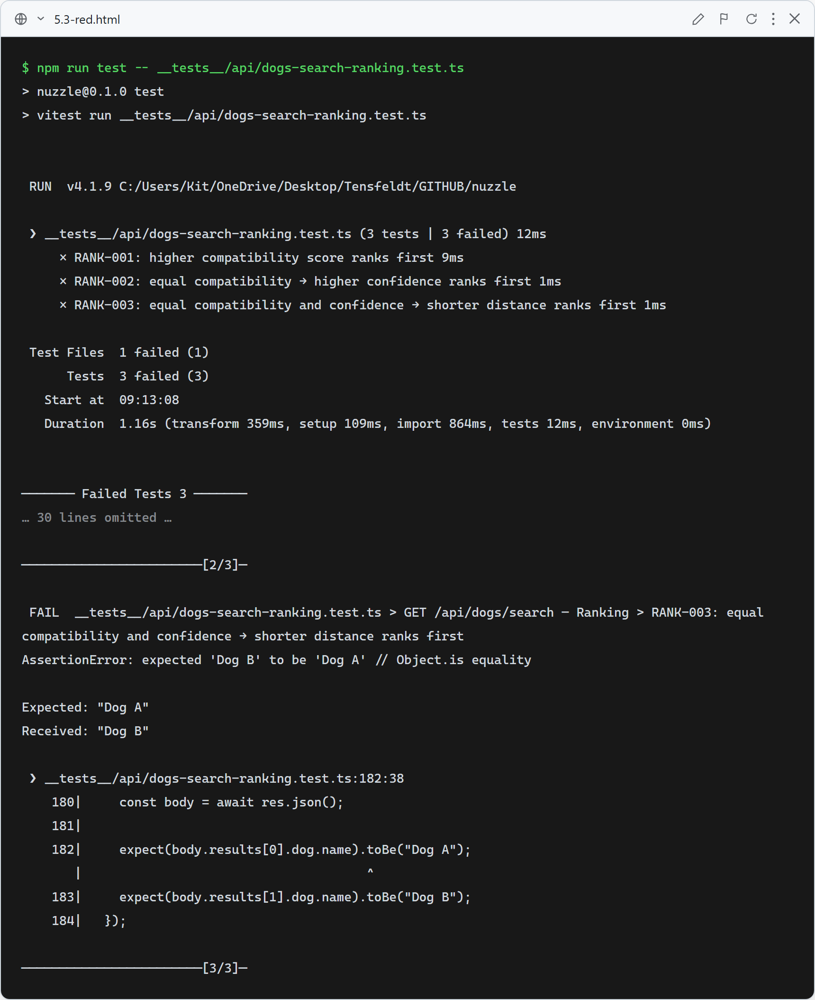
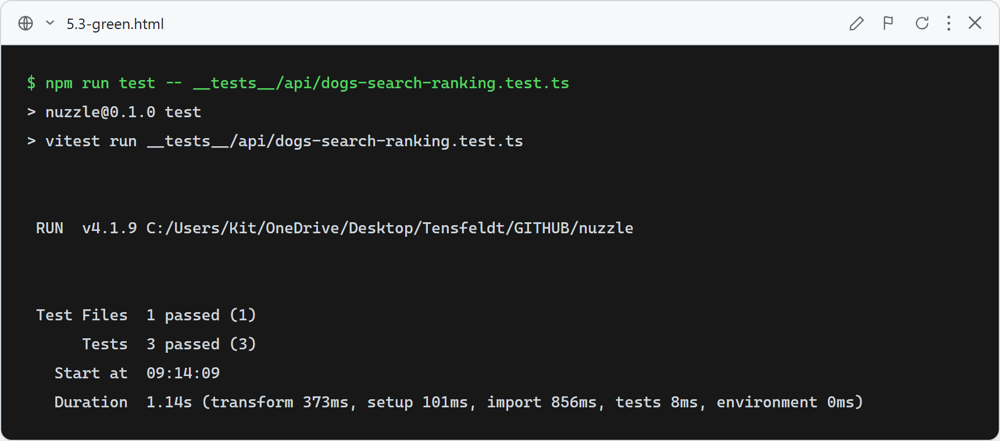

# Story 5.3 — Ranked Search Results

## Red

Existing route has no ranking logic — results returned in provider order (DogB first). All 3 RANK tests fail: expected "Dog A" first in each case, received "Dog B".

## Green

All 3 ranking tests pass: higher compatibility score ranks first (RANK-001), equal score → higher confidence ranks first (RANK-002), equal score + confidence → shorter distance ranks first (RANK-003). Route now sorts profiled results by score desc → confidence desc → distance asc.

