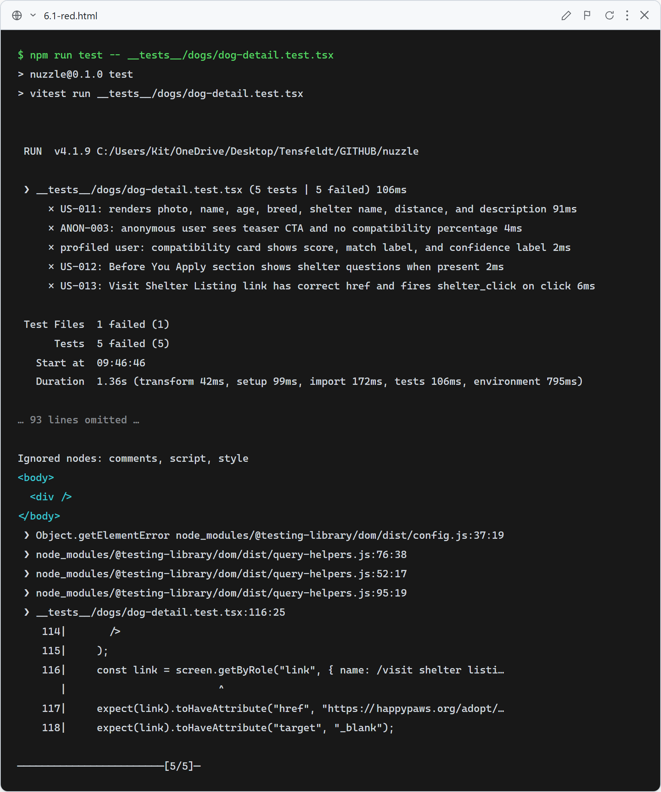
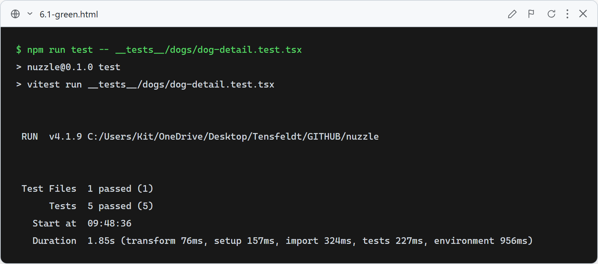

# Story 6.1 — Dog Detail Page

## Red

Stub `DogDetailClient` returns `null` — all 5 tests fail because `getByRole("img")`, `getByRole("heading")`, and other queries find no elements in the empty render.

## Green

All 5 tests pass: dog fields render correctly (US-011), anonymous user sees teaser CTA with no score percentage (ANON-003), profiled user sees score + match label + confidence label, "Before You Apply" section appears when `shelterQuestions` is non-empty (US-012), and "Visit Shelter Listing" link fires `shelter_click` event on click (US-013).

