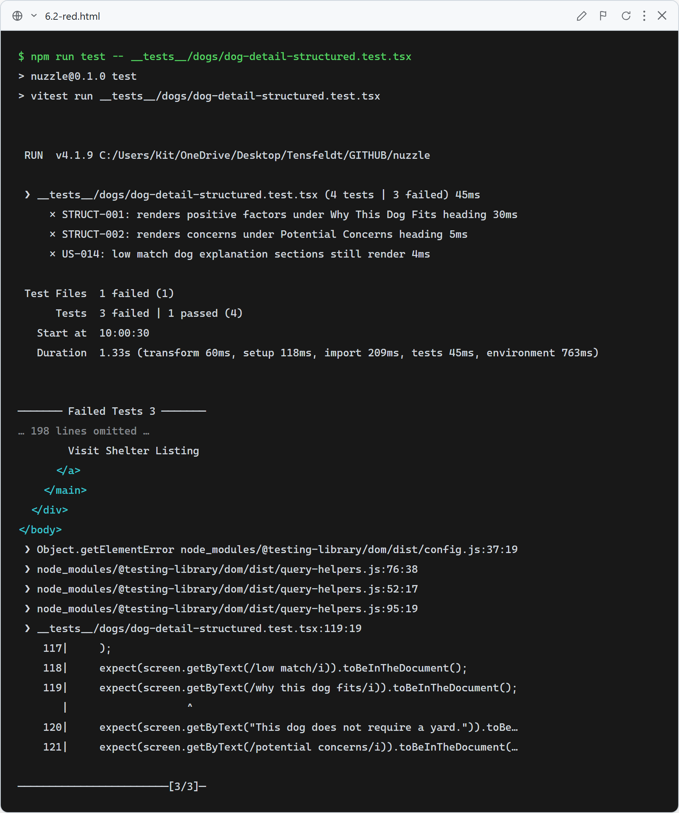
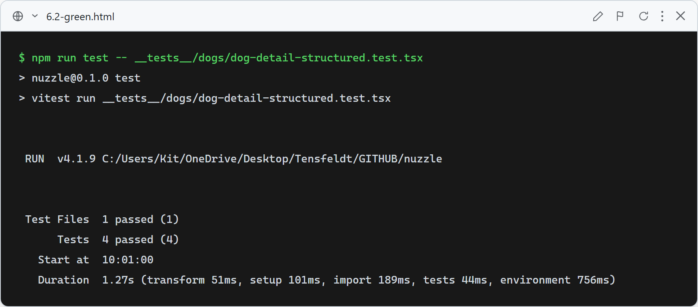

# Story 6.2 — Structured Explanations

## Red

`DogDetailClient` does not yet render `positiveFactors` or `concerns` — STRUCT-001, STRUCT-002, and US-014 all fail because "Why This Dog Fits" and "Potential Concerns" headings are absent. STRUCT-003 passes (the section genuinely doesn't exist yet, so `queryByText` correctly returns null).

## Green

All 4 tests pass: positive factors render under "Why This Dog Fits" (STRUCT-001), concerns render under "Potential Concerns" (STRUCT-002), the Potential Concerns section is absent when `concerns` is empty (STRUCT-003), and a Low Match dog still shows both explanation sections (US-014).

