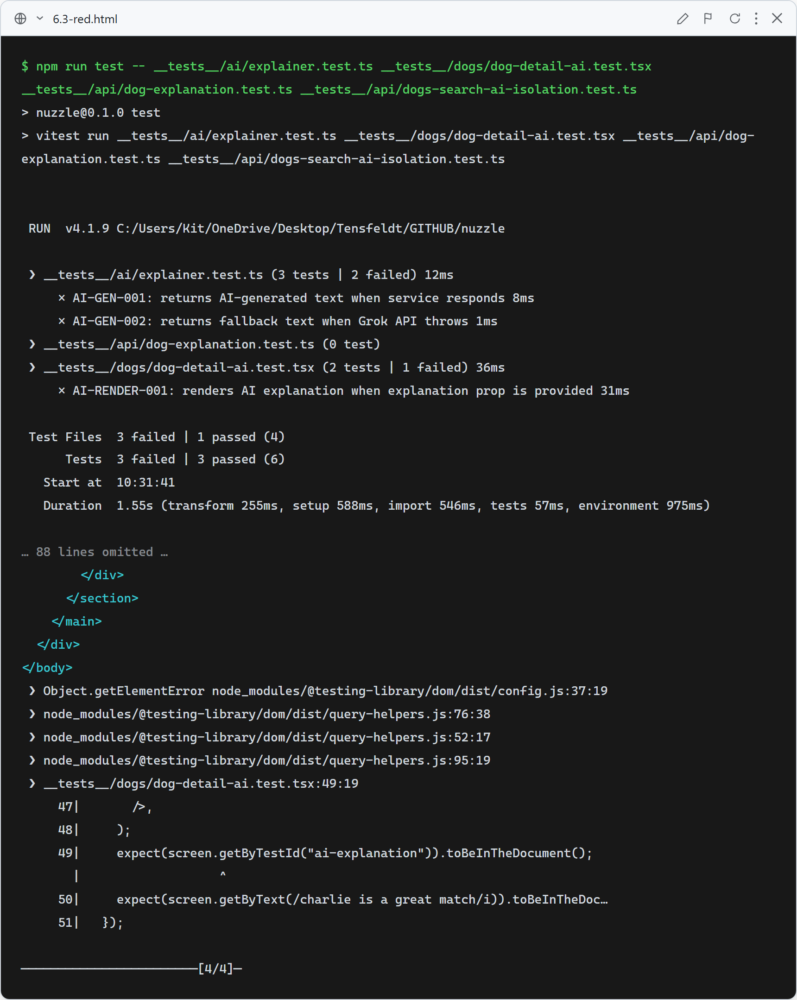
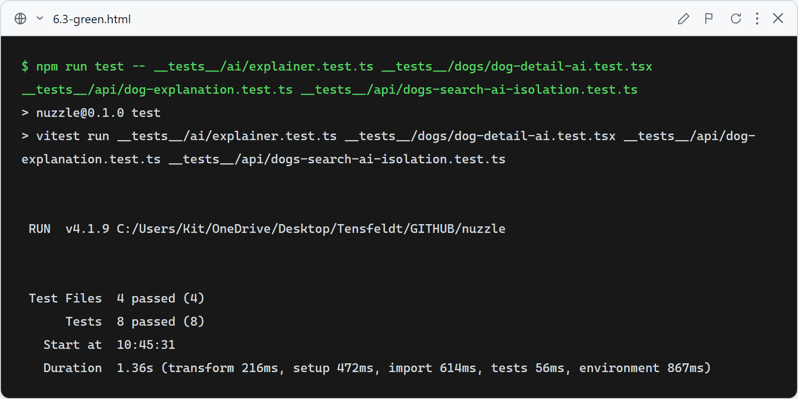

# Story 6.3 — AI Explanation Layer

## Red

Stub `lib/ai/explainer.ts` returns `null` — AI-GEN-001 fails (null ≠ expected text), AI-GEN-002 fails (fallback string check fails), AI-RENDER-001 fails (no `data-testid="ai-explanation"` element), and the explanation route doesn't exist so the cache tests fail at import. AI-GEN-003, AI-RENDER-002, and AI-SEARCH-001 pass as guard tests.

## Green

All 8 tests pass: `generateExplanation` returns AI text when Grok responds (AI-GEN-001) and falls back gracefully when the API returns no content (AI-GEN-002), the result is never mutated (AI-GEN-003), `DogDetailClient` renders the explanation paragraph with `data-testid` when provided and omits it when null (AI-RENDER-001/002), the cache route returns a freshly generated explanation on first call and the cached text on second without re-calling Grok (AI-CACHE-001/002), and the search route never touches the AI layer (AI-SEARCH-001).

