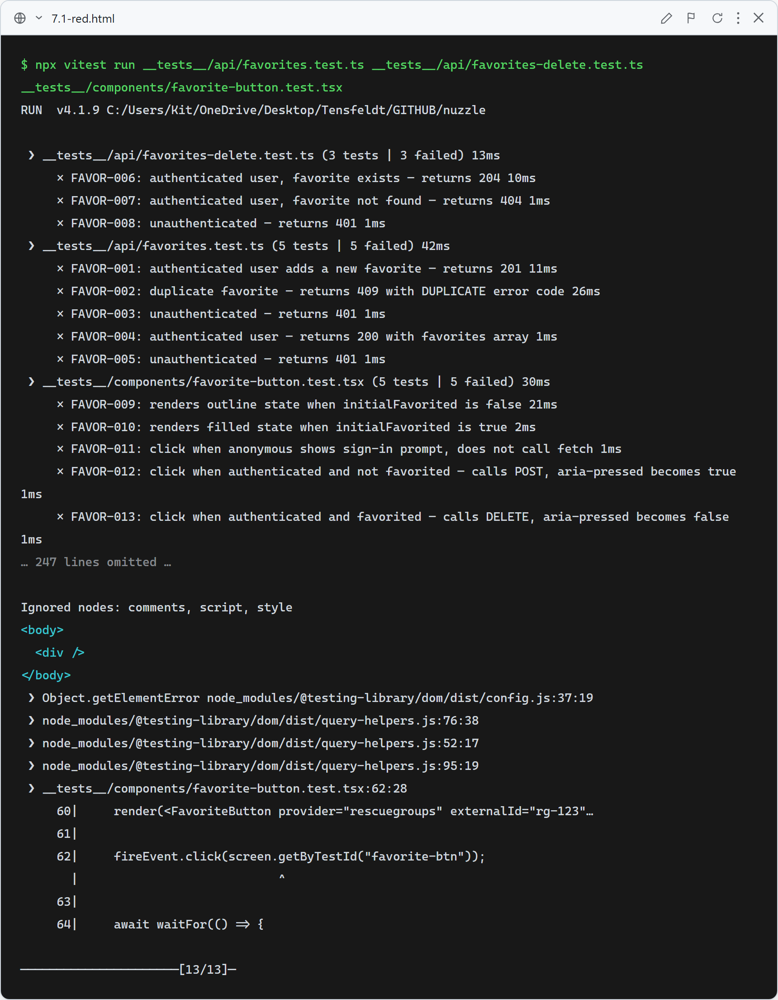
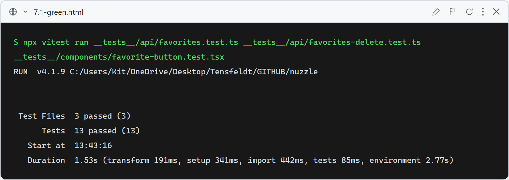

# Story 7.1 — Favorites

## Red

Stubs return 501 from all API endpoints — FAVOR-001 through FAVOR-008 fail on status code assertions. FavoriteButton stub returns `null`, so FAVOR-009 through FAVOR-013 fail with "Unable to find element by: [data-testid='favorite-btn']". All 13 tests fail on assertions (not import errors).

## Green

All 13 tests pass: POST /api/favorites returns 201 with the saved favorite (FAVOR-001), 409 on duplicate via Prisma P2002 constraint (FAVOR-002), and 401 for unauthenticated requests (FAVOR-003). GET /api/favorites returns a sorted array (FAVOR-004) or 401 (FAVOR-005). DELETE returns 204 when found (FAVOR-006), 404 when not found (FAVOR-007), and 401 unauthenticated (FAVOR-008). FavoriteButton renders the correct aria-pressed state (FAVOR-009/010), shows a sign-in prompt for anonymous users without calling fetch (FAVOR-011), and optimistically toggles to filled on POST (FAVOR-012) or empty on DELETE (FAVOR-013).

