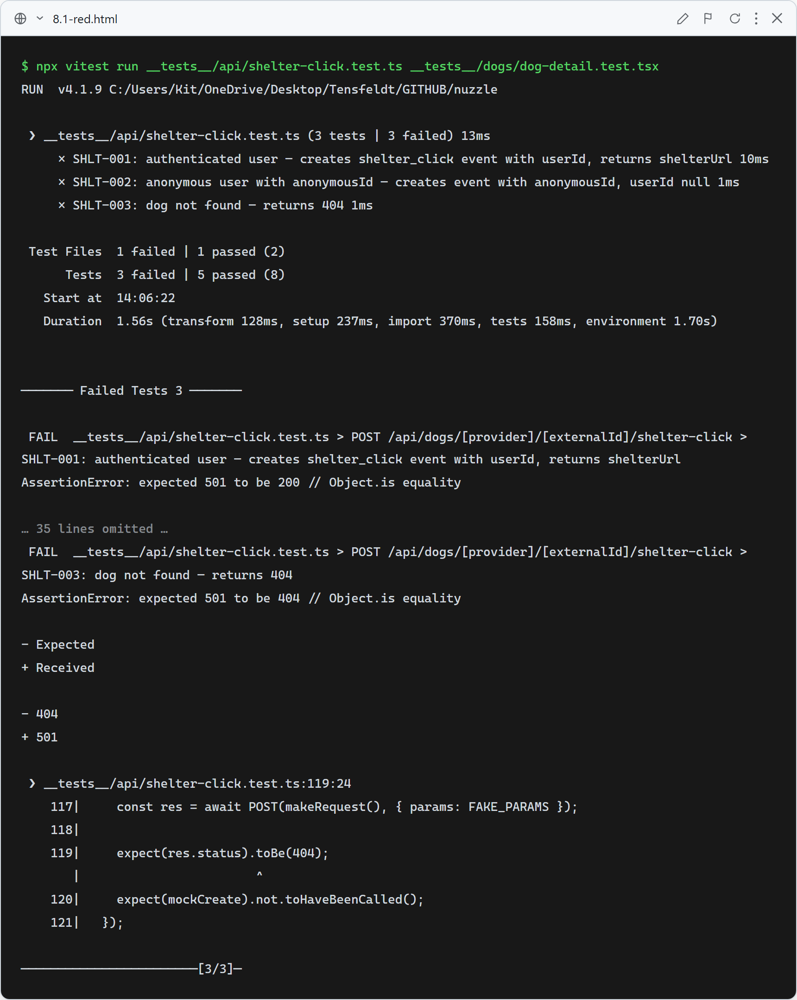
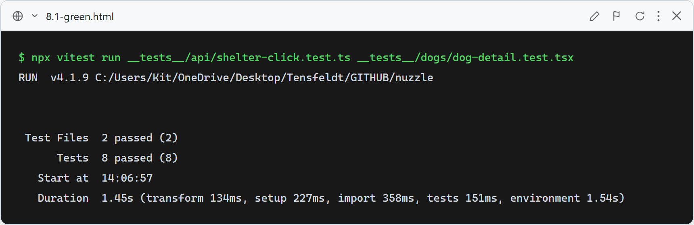

# Story 8.1 — Shelter Redirect Tracking

## Red

Stub route returns 501 — SHLT-001, SHLT-002, SHLT-003 all fail on status code assertions (expected 200/404, received 501). The `DogDetailClient` is already updated to call `fetch()` instead of dispatching a custom DOM event, so US-013 passes in the red run (the fetch wiring is correct before the route is implemented).

## Green

All 8 tests pass: `POST /api/dogs/[provider]/[externalId]/shelter-click` creates a `shelter_click` `AnalyticsEvent` row with `userId` for authenticated users (SHLT-001) and with `anonymousId` from the request body for anonymous users (SHLT-002), returns `{ shelterUrl }` in both cases, and returns 404 when the dog is not found (SHLT-003). The "Visit Shelter Listing" link still carries the correct `href` and its click fires a background `POST` to the shelter-click API instead of the previous custom DOM event (US-013).

