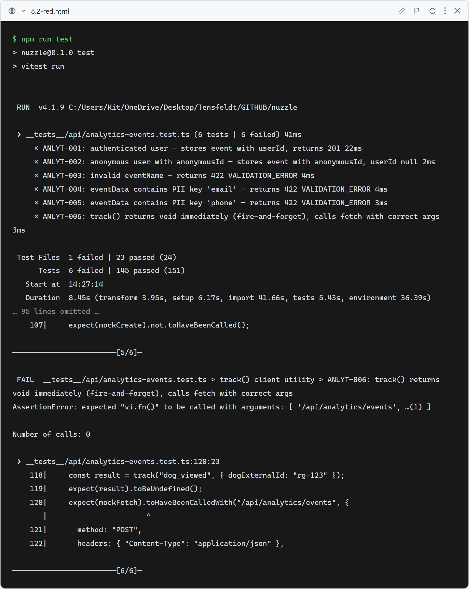
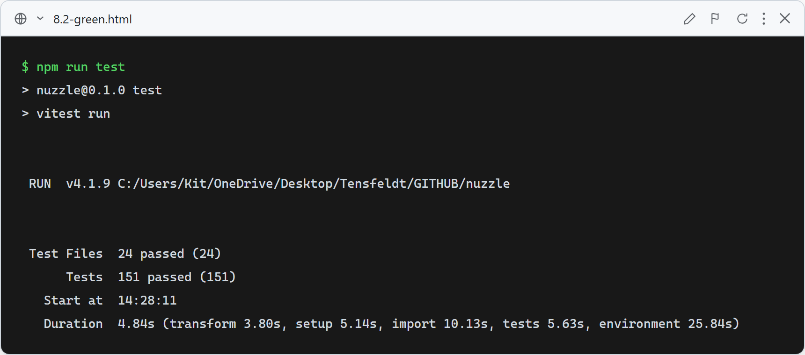

# Story 8.2 — Analytics Foundation

## Red

Stub route returns 501 — ANLYT-001 through ANLYT-005 fail on status code assertions (expected 201/422, received 501). ANLYT-006 fails because the stub `track()` has an empty body and never calls `fetch` (mock call count is 0).

## Green

All 6 tests pass: `POST /api/analytics/events` creates an `AnalyticsEvent` row with `userId` for authenticated users (ANLYT-001), with `anonymousId` for anonymous users (ANLYT-002), rejects unknown `eventName` values with 422 (ANLYT-003), rejects `eventData` containing the PII keys `email` or `phone` with 422 (ANLYT-004, ANLYT-005). The `track()` utility returns `undefined` immediately and calls `fetch` fire-and-forget with the correct payload (ANLYT-006). Full suite: 151 tests passing.

