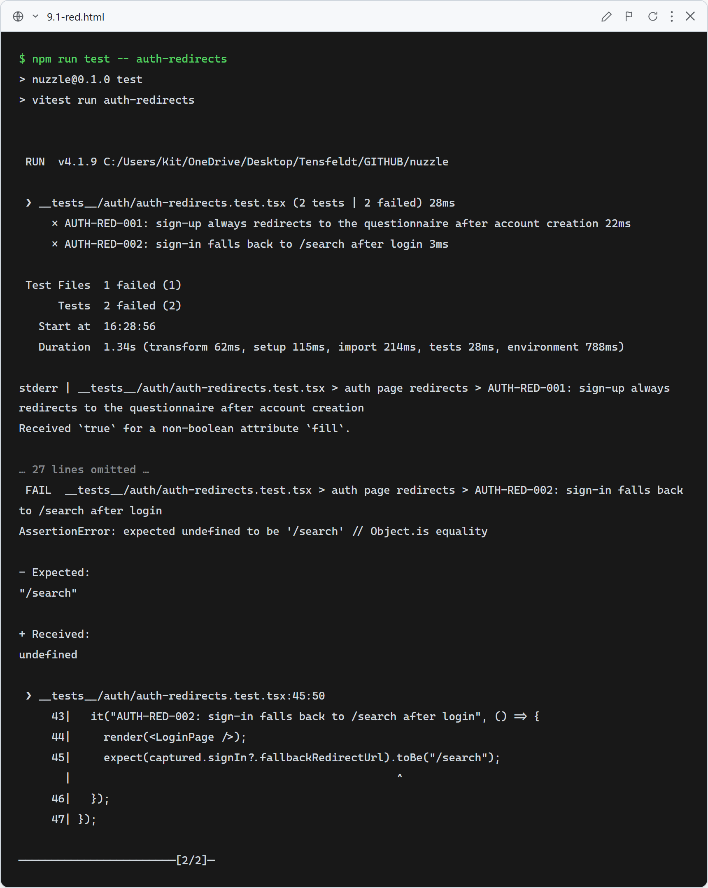
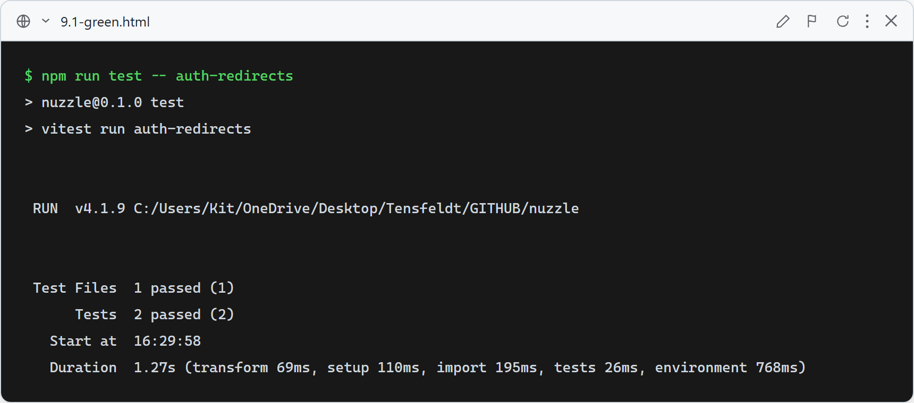

# 9.1: Auth page redirects

**What these tests verify:** the Sign Up page renders Clerk's `<SignUp>` with `forceRedirectUrl="/questionnaire"` (so a new account always lands on the questionnaire), and the Login page renders Clerk's `<SignIn>` with `fallbackRedirectUrl="/search"`.

### Red (failing — before implementation)

Both assertions fail with `expected "/questionnaire"/"/search", got undefined` — the redirect props were not passed.

### Green (passing — after implementation)

After adding `forceRedirectUrl`/`fallbackRedirectUrl` to the auth pages, both tests pass.
