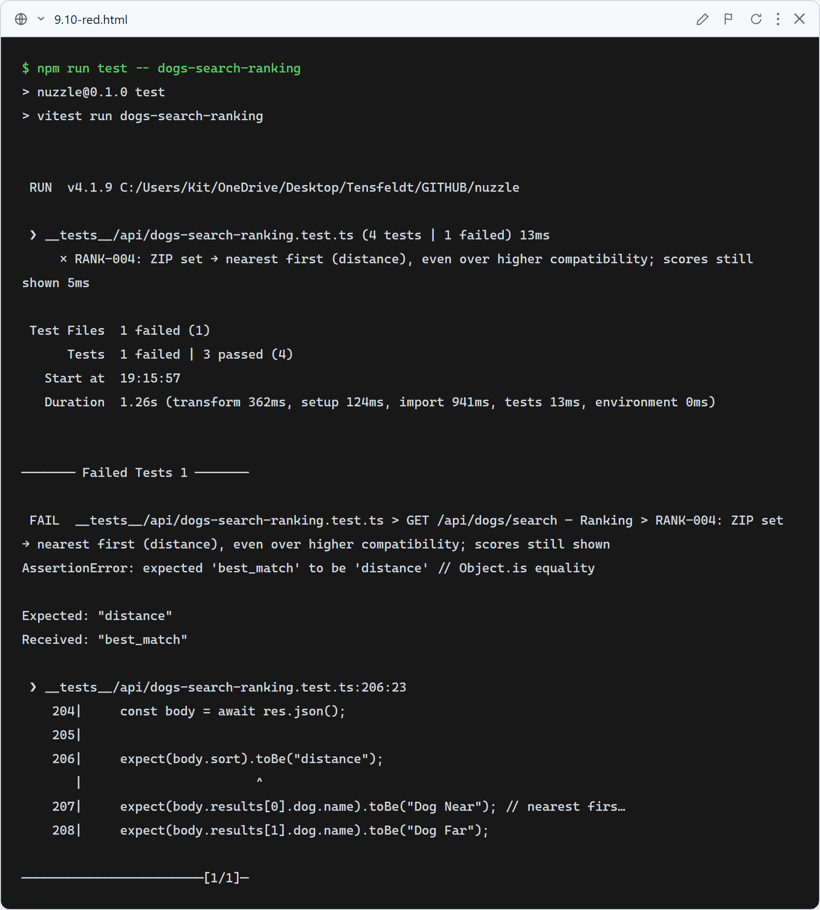
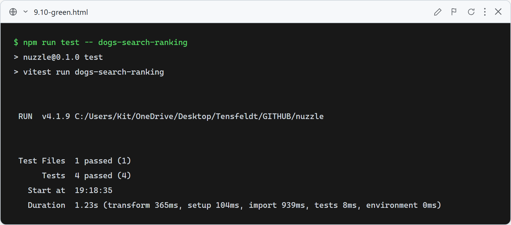

# 9.10: Nearest-first ordering when a ZIP is set

**What this verifies:** for a profiled user, setting a ZIP switches the result order to **distance (nearest first)** — even a nearer dog with a lower compatibility score ranks above a farther, higher-scoring one — while the match scores are still computed and shown (`body.sort === "distance"`, `results[0].compatibility` present). Without a ZIP, the order stays best-match (RANK-001/002/003: Compatibility → Confidence → Distance).

### Red (failing — before implementation)

RANK-004 fails: with a ZIP the API still returned best-match order (`sort` was `best_match`, the higher-compatibility farther dog ranked first).

### Green (passing — after implementation)

With a ZIP the API now sorts nearest-first (compatibility breaks ties) and still scores profiled users; RANK-001/002/003 (no ZIP) continue to validate the best-match order.
