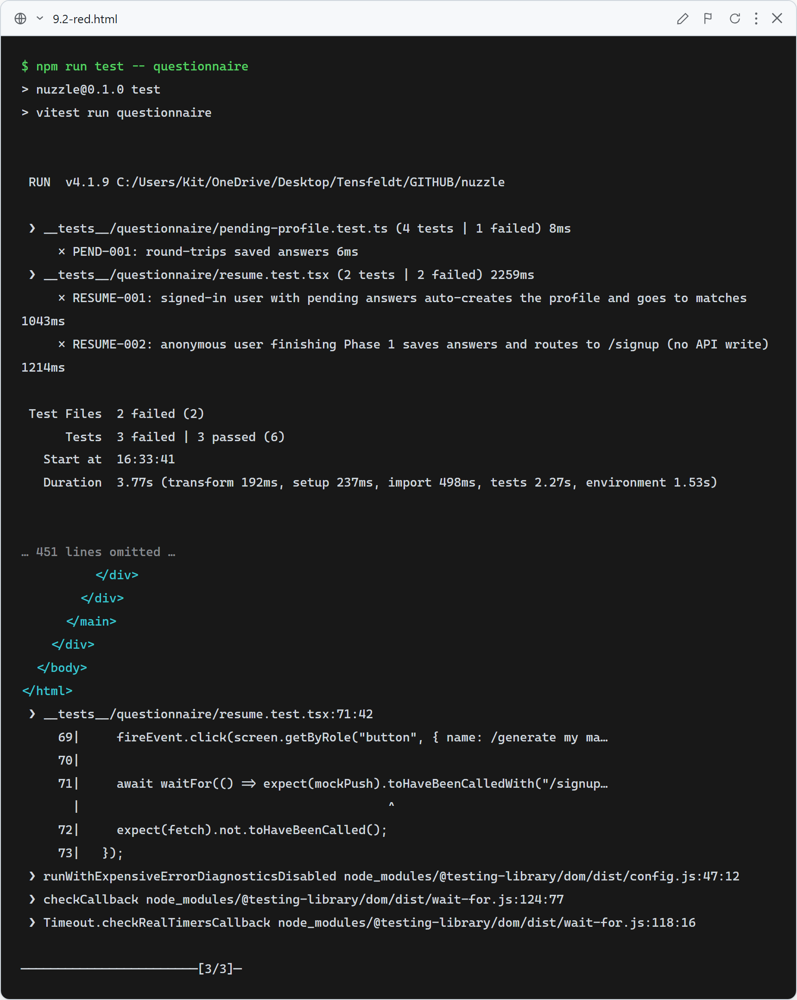
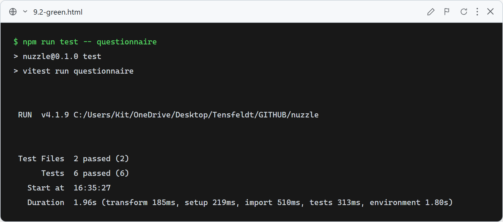

# 9.2: Questionnaire ↔ account creation

**What these tests verify:**
- `pending-profile` storage (PEND-001…004): Phase-1 answers round-trip through `localStorage`, return `null` when absent or corrupt, and clear correctly.
- Resume (RESUME-001): a signed-in user who returns to `/questionnaire` with pending answers auto-POSTs `/api/profile` and is redirected to `/search?source=questionnaire`.
- Anonymous routing (RESUME-002): an anonymous user who finishes Phase 1 saves their answers and is routed to `/signup` with **no** API write.

### Red (failing — before implementation)

With the stubbed storage and no resume/anonymous logic, the round-trip, resume, and anonymous-routing assertions fail.

### Green (passing — after implementation)

After implementing the storage helper and wiring resume + anonymous routing into `QuestionnaireClient`, all 6 tests pass.
