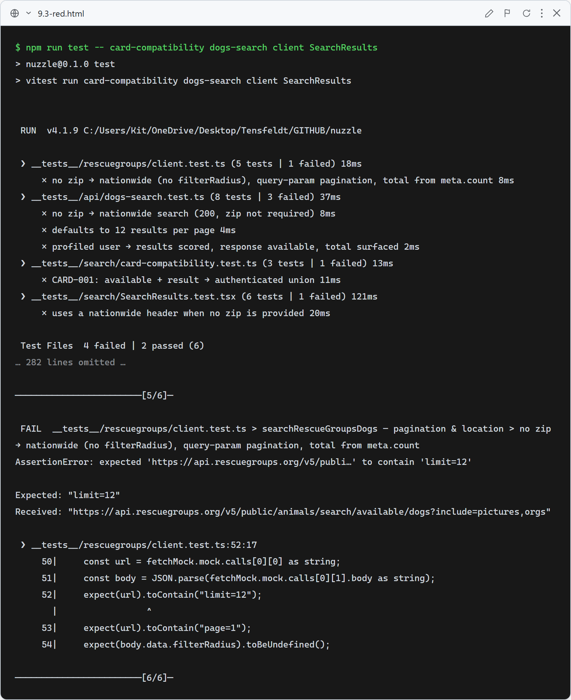
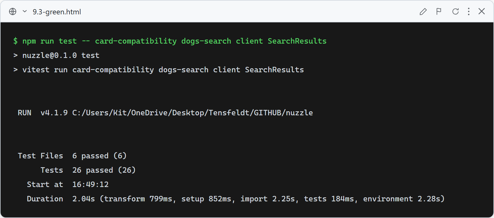

# 9.3: Nationwide, ranked, paginated matches

**What these tests verify:**
- `toCardCompatibility` (CARD-001…003): maps the search API's per-result shape into the DogCard discriminated union (authenticated when scored, teaser otherwise). This is the wiring fix that makes scores actually show.
- Search API: works with **no zip** (nationwide, 200 not 422), forwards `zip: undefined`, defaults to **12** per page, and a profiled user gets scored results + `total`.
- RG client: with no zip the request omits `filterRadius`, paginates via the `limit`/`page` **query params**, and reads the total from **`meta.count`**.
- `SearchResults`: renders the compatibility score for authenticated results and uses a nationwide header ("Showing Your Matches") when no zip is given.

### Red (failing — before implementation)

6 assertions fail: the helper returns a teaser even when available; the API 422s without a zip and defaults to 20 with no `total`; the client uses body pagination and the wrong meta field; SearchResults shows the nearby-only header.

### Green (passing — after implementation)

After fixing the client pagination/total, making zip optional in the API (default limit 12 + `total`), adding `toCardCompatibility`, and wiring the union through `SearchResults`/`SearchPageClient`, all pass.
