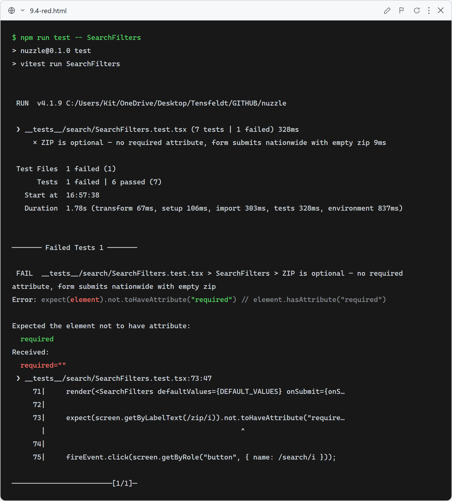
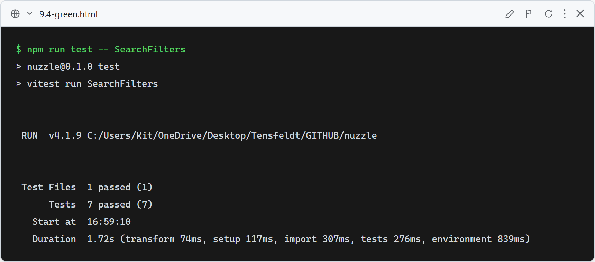

# 9.4: Nationwide dogs for anonymous visitors (zip optional)

**What this test verifies:** the ZIP field on `SearchFilters` is no longer `required` and the form submits with an empty zip (a nationwide search). Combined with `SearchPageClient` auto-loading on mount, anonymous visitors now see nationwide dogs immediately and can optionally enter a zip to filter by distance.

### Red (failing — before implementation)

The ZIP input still carries the `required` attribute, so the "ZIP is optional" assertion fails.

### Green (passing — after implementation)

After removing `required` (and updating the placeholder), the field is optional and the form submits nationwide with an empty zip.
