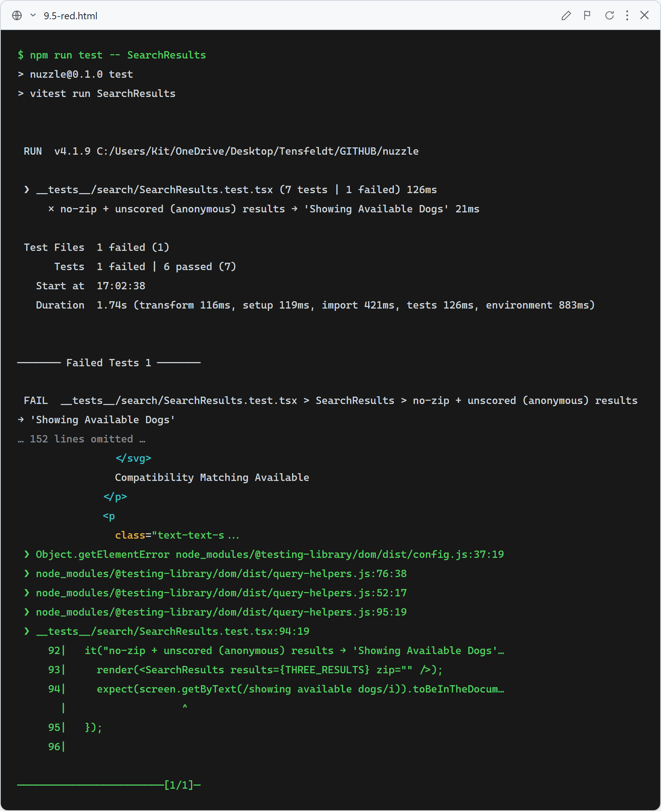
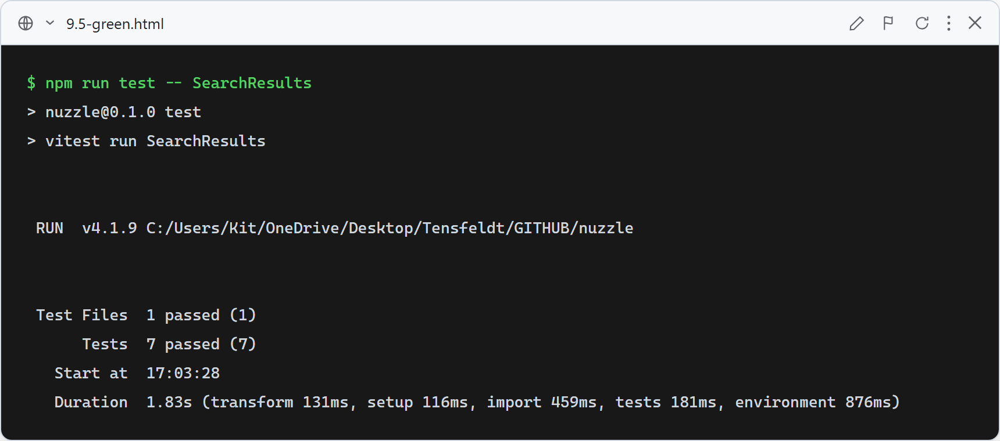

# 9.5: Neutral results header for anonymous visitors

**What these tests verify:** the no-zip results header reads **"Showing Available Dogs"** when the results are unscored (anonymous / no profile), and **"Showing Your Matches"** only when results are actually scored. A zip filter still shows "Showing Nearby Dogs".

### Red (failing — before implementation)

With the previous hard-coded "Showing Your Matches" for any no-zip search, the anonymous case fails the "Showing Available Dogs" assertion.

### Green (passing — after implementation)

After deriving the label from whether any result is scored (`compatibility.available`), anonymous visitors see "Showing Available Dogs" and profiled users see "Showing Your Matches".
