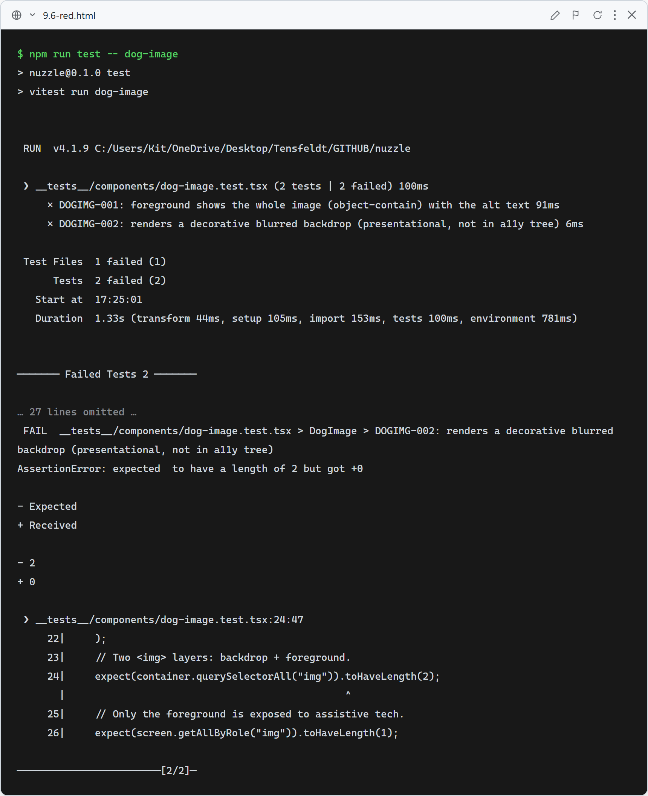
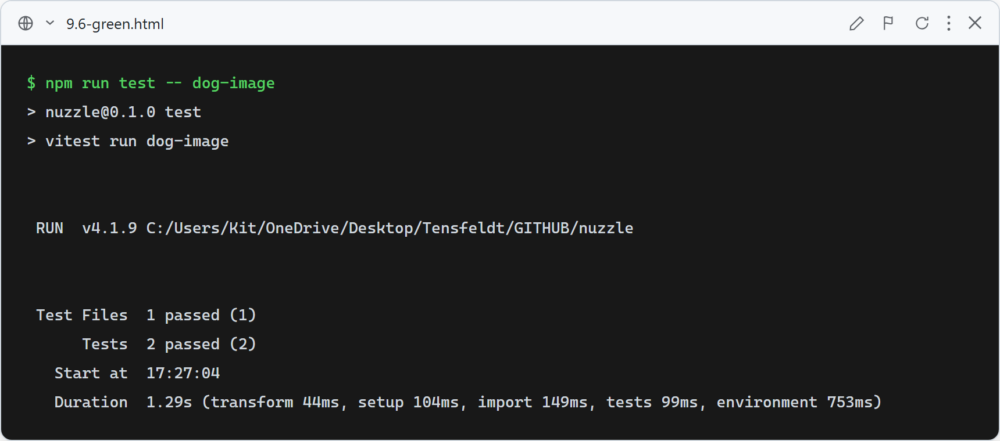

# 9.6: DogImage — show the whole dog (no cropped faces)

**What these tests verify:** the shared `DogImage` renders the photo at `object-contain` (whole image, face never cropped) as the foreground with the dog's alt text, over a decorative blurred backdrop that is hidden from assistive tech (so exactly one `img` is exposed in the a11y tree).

### Red (failing — before implementation)

The stub renders nothing, so neither the object-contain foreground nor the two-layer backdrop exists.

### Green (passing — after implementation)

`DogImage` renders the contained foreground + blurred backdrop; it's applied to DogCard, FeaturedDogs, and the favorites list so faces are no longer cropped.
