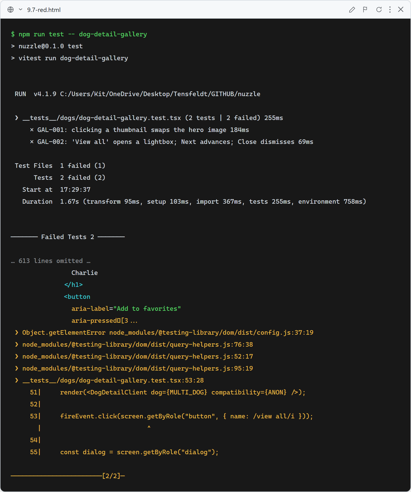
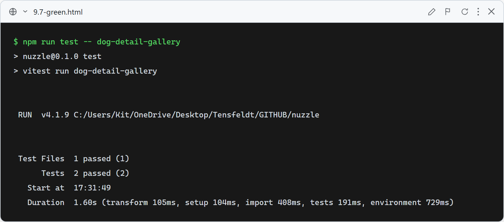

# 9.7: Interactive dog-detail photo gallery

**What these tests verify (multi-photo dog):**
- GAL-001: clicking a side thumbnail swaps the large hero image.
- GAL-002: when a dog has more than 4 photos, a "View all" control opens a lightbox dialog (carousel); "Next" advances the photo (counter `1 / 6` → `2 / 6`); "Close" dismisses it.

The single-photo detail tests stay green (no thumbnails, no view-all, no modal).

### Red (failing — before implementation)

The thumbnails were static, so the "View photo" / "View all" controls and the lightbox dialog don't exist.

### Green (passing — after implementation)

Thumbnails are now buttons that swap the hero; >4 photos opens a portal lightbox with Prev/Next/counter/close (and Escape / arrow keys).
