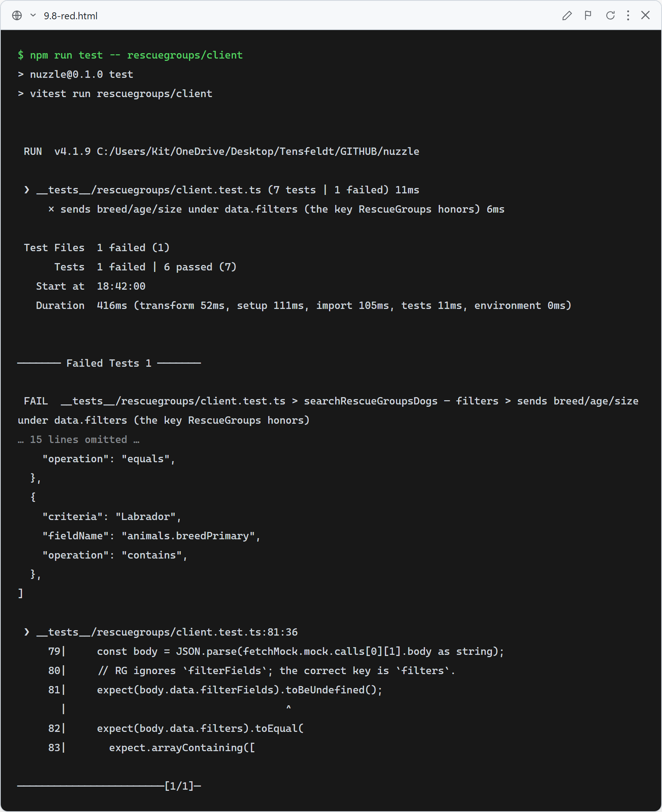
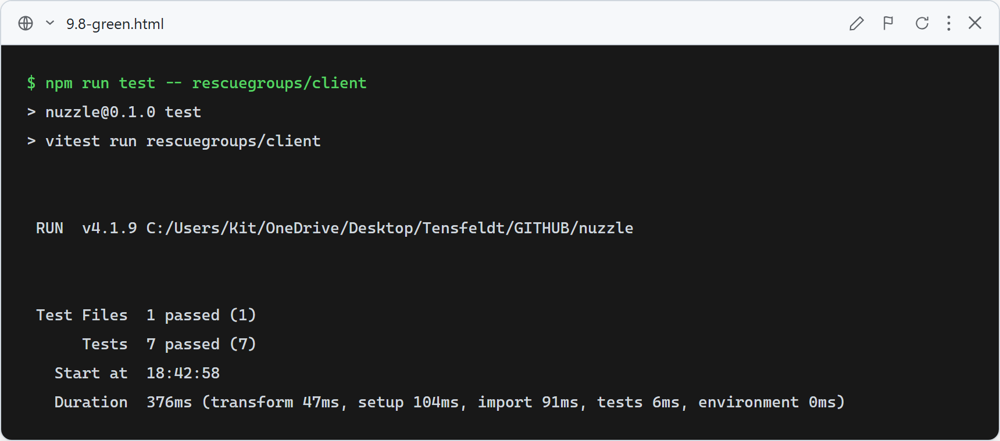

# 9.8: Search filters actually filter (RG `filters` key)

**What this test verifies:** `searchRescueGroupsDogs` sends breed/age/size under `data.filters` (the key RescueGroups v5 honors) — not `data.filterFields`, which RG silently ignores — and omits `filters` when none are provided.

**Root cause (verified live):** with `filterFields`, breed=Labrador returned all 33,062 dogs (no filtering). With `filters`, breed=Labrador returned 3,668 (all Labrador Retriever); `animals.ageGroup`/`animals.sizeGroup` equals also narrow and AND-combine. Filters were broken for everyone; authenticated users couldn't tell because results are always compatibility-sorted.

### Red (failing — before implementation)

The request body still used `filterFields`, so `data.filters` was undefined.

### Green (passing — after implementation)

Renaming the request key to `filters` makes breed/age/size filter for all users (anonymous and profiled).
