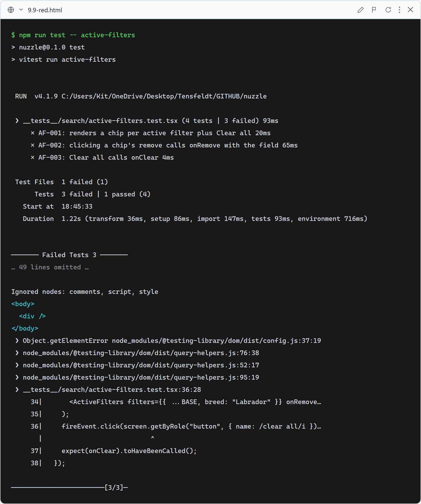
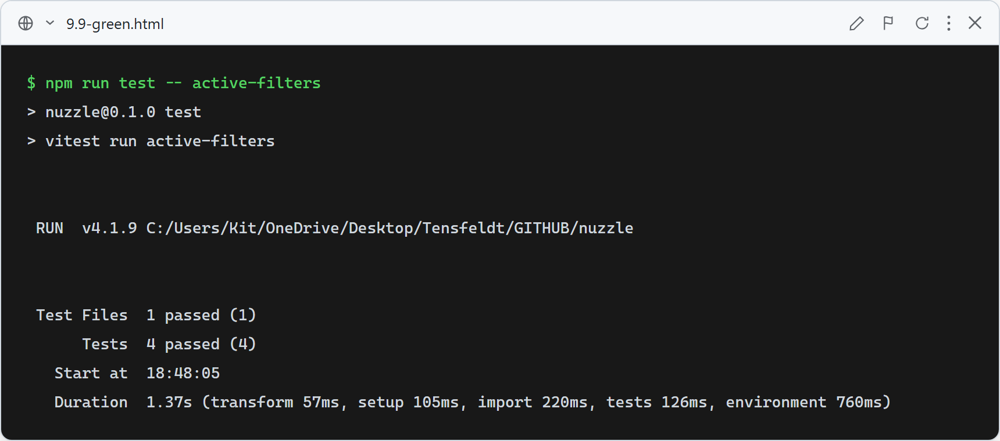

# 9.9: Removable active-filter chips + Clear all

**What these tests verify (`ActiveFilters`):** a chip renders for each active filter (Breed / Age via `formatAgeGroup` / Size / location) plus a "Clear all filters" button; clicking a chip's ✕ calls `onRemove(field)`; "Clear all" calls `onClear`; nothing renders when no filters are active.

`SearchPageClient` renders `<ActiveFilters>` between the filter bar and results, wired so removing a chip or clearing re-runs the search and re-syncs the form — returning the user to their overall matches.

### Red (failing — before implementation)

The stub renders nothing, so the chips and Clear-all assertions fail (only the empty-state case passes).

### Green (passing — after implementation)

`ActiveFilters` renders removable chips + Clear all; all four cases pass.
