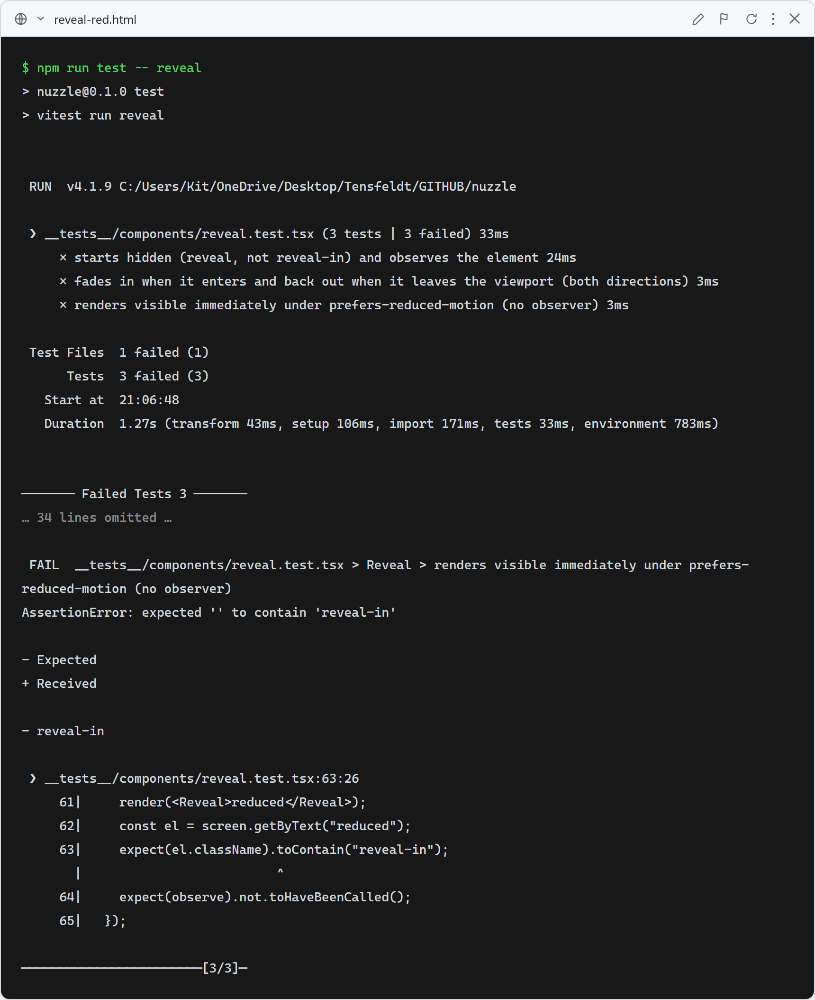
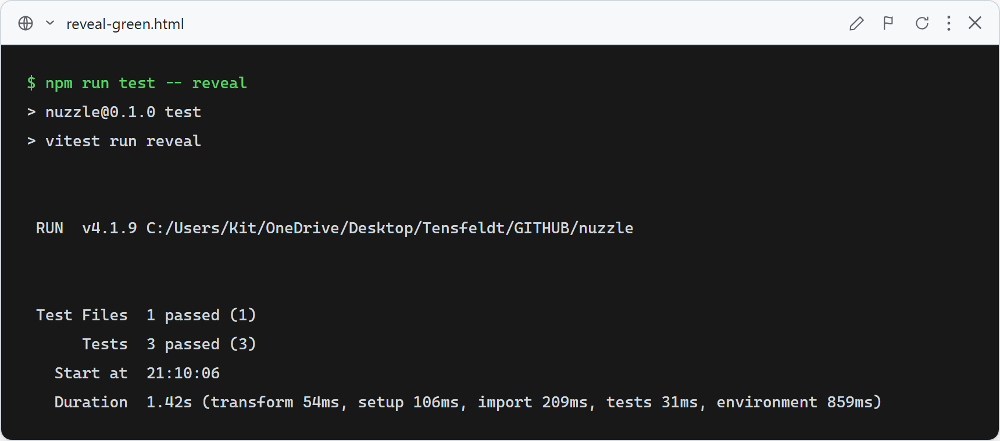

# Reveal — scroll fade in/out (both directions)

**What this verifies:** the `Reveal` wrapper fades + slides its children in when they enter the viewport and back out when they leave (both directions, via IntersectionObserver firing on enter and exit), and degrades gracefully when motion is reduced or the observer is unavailable.

- Starts hidden (`reveal`, not `reveal-in`) and observes the element.
- IO callback with `isIntersecting: true` adds `reveal-in`; with `false` removes it (fades back out on scroll-up).
- Under `prefers-reduced-motion` it renders visible immediately and never observes.

Used to fade the homepage sections (value props, how it works, featured dogs, profile banner) on scroll. All gated behind `prefers-reduced-motion` (Rule 13).

### Red (failing — before implementation)

Stub `Reveal` returns a plain `
` with no class toggle / no observer: 3 failed (no `reveal` class, no `reveal-in` toggle, no reduced-motion path).

### Green (passing — after implementation)

IntersectionObserver-based `Reveal` implemented (both directions + reduced-motion/no-observer fallback). 3/3 pass; full suite green (the homepage `page.test.tsx` still renders since `Reveal` degrades safely without IO/matchMedia in jsdom).
