# Visual Design Reference — Nuzzle

Status: Reference only — not a specification

This document captures the visual design system observed in the high-fidelity mockups. It is the primary reference for colors, typography, component patterns, and layout details during frontend implementation.

For interaction behavior and UX rules, see `docs/ux/ux-spec.md`.
For screen content hierarchy and layout structure, see `docs/ux/wireframe-spec.md`.

---

## Mockup Image Library

| File | Screen |
|------|--------|
| `mockups/01-mockup-homepage.png` | Screen 1 — Home Page |
| `mockups/02-mockup-browse-anon.png` | Screen 2 — Browse Dogs (Anonymous) |
| `mockups/03-mockup-browse-auth.png` | Screen 3 — Browse Dogs (Authenticated) |
| `mockups/04-mockup-dog-detail-anon.png` | Screen 4 — Dog Detail (Anonymous) |
| `mockups/05-mockup-dog-detail-auth.png` | Screen 5 — Dog Detail (Authenticated) |
| `mockups/06-mockup-questionnaire-1.png` | Screen 6 — Quick Match Questionnaire |
| `mockups/07-mockup-questionnaire-2.png` | Screen 7 — Expanded Questionnaire |
| `mockups/08-mockup-match-results.png` | Screen 8 — Match Results |
| `mockups/09-mockup-modal-save-favs.png` | Screen 9 — Account Creation Prompt |
| `mockups/10-mockup-user-dashboard.png` | Screen 10 — User Dashboard / Favorites |
| `mockups/11-mockup-edit-profile.png` | Screen 11 — Edit Profile |
| `mockups/12-mockup-login.png` | Screen 12 — Login |
| `mockups/13-mockup-signup.png` | Screen 13 — Sign Up |

Filenames are prefixed with the screen number from `docs/ux/wireframe-spec.md` for easy cross-reference.

---

## Design Direction

Nuzzle's visual design is **warm, approachable, and nature-connected** — designed to feel like a thoughtful adoption advisor rather than an e-commerce listing site.

Key characteristics:
- **Teal primary palette** — the brand color used for the logo, navigation, interactive elements, and primary actions
- **Botanical illustration theme** — decorative illustrated plants and flowers (soft pink and green) appear in page corners and between content sections to create a welcoming, organic feel
- **Card-based layouts** — content organized into clearly defined cards with rounded corners and subtle shadows
- **Mobile-first** — layouts designed at 375px with responsive expansion to two-column grids on larger viewports
- **High trust, low clutter** — ample whitespace; critical compatibility information is always visible without excessive scrolling

---

## Design Tokens (Observed)

Values are inferred from mockup analysis. Confirm exact hex values against rendered mockups before finalizing implementation.

### Colors

| Token | Approximate Value | Usage |
|-------|-----------------|-------|
| `primary` | Teal `#20A39E` | Logo, nav icons, primary buttons, active states, card header backgrounds |
| `primary-light` | Light teal `#E0F5F4` | Hover states, selected option backgrounds |
| `secondary-cta` | Purple `#7C3AED` | "Get My Compatibility Match" button (anonymous CTA only) |
| `surface` | White `#FFFFFF` | Card backgrounds, modal backgrounds |
| `background` | Light blue-white `#F0F8FA` | Page backgrounds, content area fills |
| `hero-background` | Pale cyan `#E8F4F8` | Hero section background on homepage |
| `text-primary` | Dark navy `#1E293B` | Headlines, dog names, primary labels |
| `text-secondary` | Medium gray `#64748B` | Breed, shelter name, distance, supporting text |
| `border` | Light gray `#E2E8F0` | Card borders, input borders, dividers |
| `match-high-bg` | Teal-green (bright) | High match score badge backgrounds (80%+) |
| `match-high-text` | Dark green | High match label and percentage text |
| `match-medium-bg` | Amber/orange | Medium match badge backgrounds (60–79%) |
| `match-medium-text` | Dark amber | Medium match label text |
| `match-low-bg` | Pink/coral | Low match badge backgrounds (<60%) |
| `match-low-text` | Dark red | Low match label text |
| `concern-indicator` | Orange `#F97316` | Potential concern bullet/icon color |
| `question-indicator` | Blue `#3B82F6` | Shelter question bullet/icon color |
| `botanical-pink` | Soft pink | Decorative floral illustration color |
| `botanical-green` | Soft green | Decorative leaf illustration color |

### Typography

- **Page headline** ("Find a dog that fits your lifestyle."): Bold, large, tight line-height
- **Dog name (card + detail)**: Semibold, ~18px
- **Breed/age/distance (secondary info)**: Regular, ~13px, `text-secondary` color
- **Match label** ("Strong Match", "Good Match"): Bold, ~15px, displayed inside colored badge
- **Match percentage** ("91%"): Bold, ~22px, displayed inside badge alongside match label
- **Section headers** ("Why This Dog Fits", "Before You Apply"): Semibold, ~14–16px
- **Match factors / list items**: Regular, ~14px
- **Questionnaire question text**: Bold, ~18–20px
- **Questionnaire card header** (teal background): Medium-bold, white, ~15px
- **Button text**: Semibold, sentence case
- **Body / description text**: Regular, ~15px, `text-primary`

### Spacing and Shape

| Element | Value |
|---------|-------|
| Card border radius | ~12px |
| Button border radius | ~10px (full-width) / ~8px (inline) |
| Match badge border radius | ~6px (pill-adjacent, not fully rounded) |
| Questionnaire answer card border radius | ~10px |
| Card padding | ~16px |
| Match badge padding | ~8px 12px |
| Section spacing | ~24px between major sections |

---

## Screen 1: Home Page

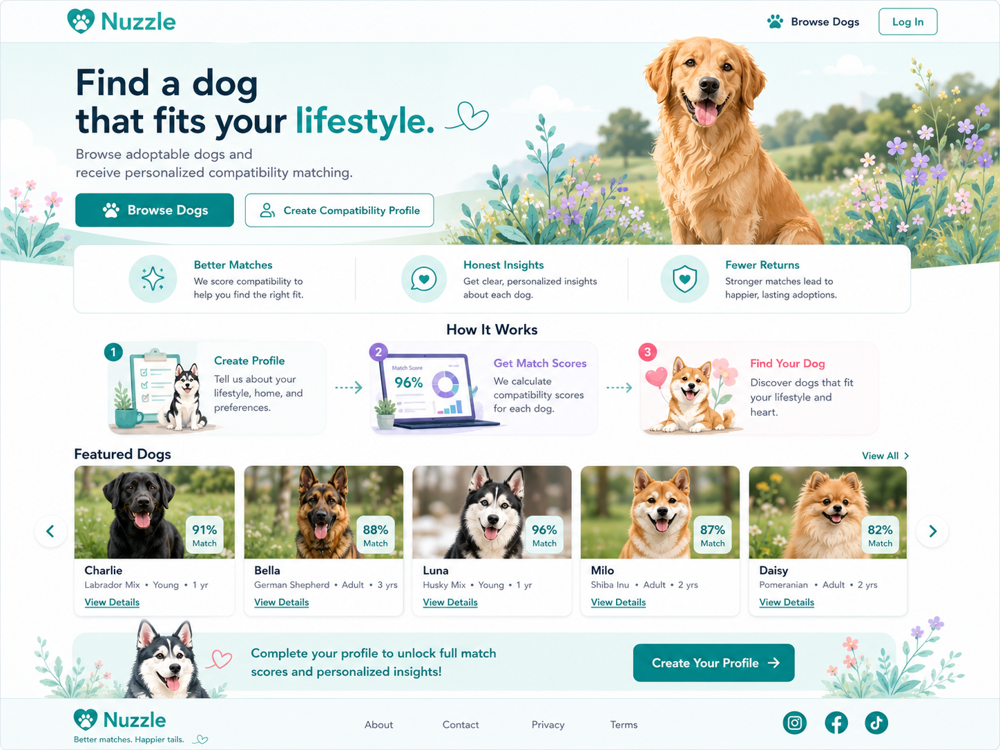

### Header / Navigation
- Nuzzle heart-shield logo (teal) left-aligned, "Nuzzle" wordmark beside it
- Right-aligned nav: "Browse Dogs" text link + "Log In" solid teal pill button
- Navigation is minimal and unobtrusive — hero content dominates

### Hero Section
- Light cyan background (`hero-background`)
- Left side: Large headline, subheadline, two CTA buttons stacked
  - **Primary CTA**: Solid teal filled button with paw icon — "Browse Dogs"
  - **Secondary CTA**: Outlined teal button — "Create Compatibility Profile"
- Right side: Photograph of a golden retriever (hero image, natural/warm)
- Decorative botanical illustrations (pink and green) at left and right edges

### "How It Works" Section
- Three-column layout with numbered circles (1, 2, 3)
- Each column: numbered icon, short bold title, one-line description
  1. Better Matches
  2. Honest Insights
  3. Fewer Returns

### Featured Dogs Section
- Heading "Featured Dogs" with carousel navigation arrows (< >)
- Horizontal scrollable row of dog cards, each showing:
  - Square dog photo
  - Compatibility percentage badge (top-right overlay, e.g., "91%")
  - Dog name bold
  - Breed, age, size in secondary text
  - "View Details" link
- Dogs shown: Charlie, Bella, Luna, Milo, Daisy (example names)

### Profile Prompt Banner
- Teal background banner below featured dogs
- Text: "Complete your profile to unlock full match scores and personalized insights"
- Teal button with arrow: "Create Your Profile"

### Footer
- Nuzzle logo + tagline on left
- Navigation links: About · Contact · Privacy · Terms
- Social media icons on right

---

## Screen 2: Browse Dogs — Anonymous

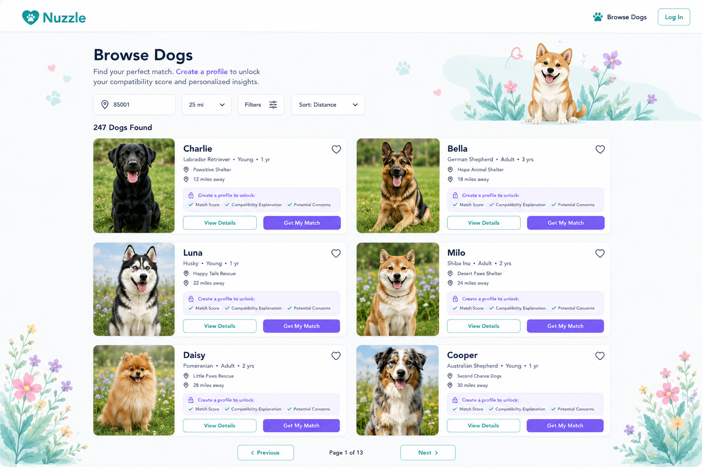

### Layout
- Header with Nuzzle logo and navigation
- **Two-column card grid** on larger viewports (responsive to single-column on narrow mobile)
- Botanical illustrations in bottom corners (decorative)

### Dog Cards (Anonymous)
Each card shows:
- Large dog photo
- Dog name (bold)
- Breed + age + size descriptor (e.g., "Golden Retriever • Adult • 2 yrs")
- Location icon + distance (e.g., "18 miles away")
- **Compatibility percentage in a visible badge** (e.g., "96%", "89%")
- "Get Match Score" CTA button (purple `secondary-cta`, prominent)
- Heart icon (outline — not authenticated, cannot save)

### Sorting / Filtering
- Sort and filter controls visible at top
- Anonymous default sort: Distance

---

## Screen 3: Browse Dogs — Authenticated

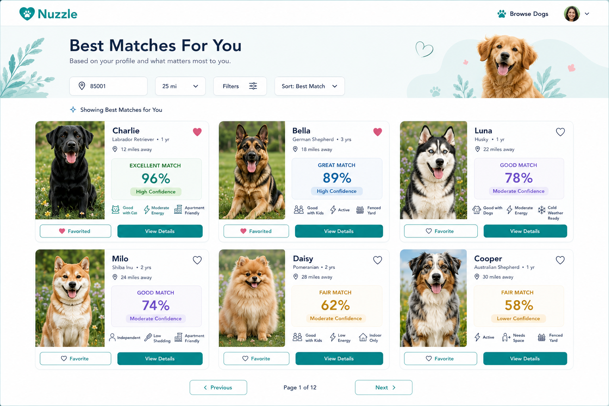

### Header
- User profile avatar (circular) appears in top-right nav — indicates authenticated state
- "Browse Dogs" label with icon

### Dog Cards (Authenticated)
Each card shows:
- Dog photo
- Dog name with heart icon (solid — can save to favorites)
- Breed, age, size, distance
- **Match score badge** (color-coded by tier):
  - 80%+: Teal/green badge
  - 60–79%: Orange/amber badge
  - <60%: Pink/coral badge
- Confidence label (text)
- Primary teal CTA button

### Layout
- Same two-column grid as anonymous browse
- Botanical corner illustrations persist

---

## Screen 4: Dog Detail — Anonymous

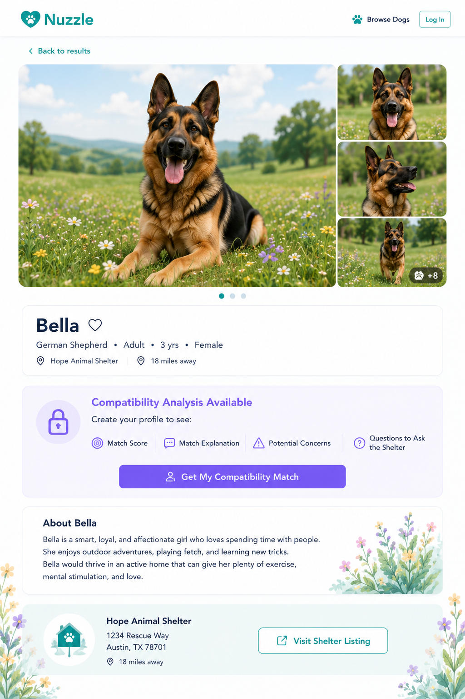

### Header
- "< Back to results" link top-left
- Logo and nav top-right (Browse Dogs, Log In)

### Photo Section
- Large full-width hero image of the dog (dominant, high quality)
- Thumbnail gallery stacked vertically on right side (3–4 thumbnails + "+ N more" indicator)
- Photo pagination dots below main image

### Dog Info
- Dog name (large bold) with heart icon outline (unauthenticated — cannot save)
- Breed + age + gender (e.g., "German Shepherd • Adult • 3 yrs • Female")
- Shelter name with location pin icon
- Distance (e.g., "18 miles away")

### Compatibility Teaser Card (Anonymous)
- "Compatibility Analysis Available" header with lock icon
- "Create your profile to see:" with checklist:
  - Match Score
  - Match Explanation
  - Potential Concerns
  - Questions to Ask the Shelter
- **Primary CTA**: Full-width purple (`secondary-cta`) button — "Get My Compatibility Match"

### About Section
- "About [Dog Name]" heading
- Shelter-provided description paragraph

### Shelter Box
- Shelter name and info
- "Visit Shelter Listing" button (outlined teal)

### Botanical Elements
- Decorative green and pink plant illustration in bottom-right corner

---

## Screen 5: Dog Detail — Authenticated

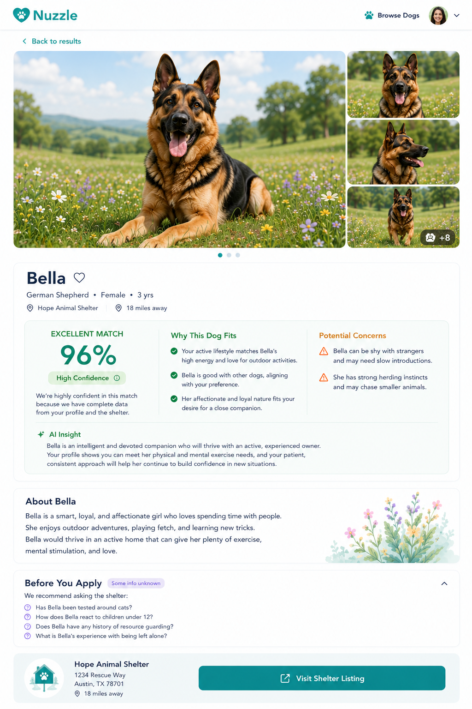

### Header
- Same back navigation
- User avatar in top-right (authenticated)

### Dog Info
- Same as anonymous layout
- Heart icon is filled/solid (can save favorites)

### Compatibility Card (Unlocked)
- **"EXCELLENT MATCH"** badge (or equivalent match label in teal/green)
- Large match percentage: "96%"
- Three-column content breakdown:
  1. **"Why This Dog Fits"** — bulleted list with green check icons (positive compatibility factors)
  2. **"Potential Concerns"** — bulleted list with orange warning icons
  3. Match detail with icons and descriptions

### AI Insight Section
- "AI Insight" header
- Detailed paragraph about personality and compatibility
- Separate from the structured breakdown

### Expandable "Before You Apply" Section
- Collapsible section header with chevron/arrow indicator
- "We recommend asking the shelter:"
- Bulleted dog-specific questions (uses dog's name)

### Shelter Information
- "Visit Shelter Listing" button (teal, full-width)
- Shelter hours, distance, contact details

---

## Screen 6: Quick Match Questionnaire

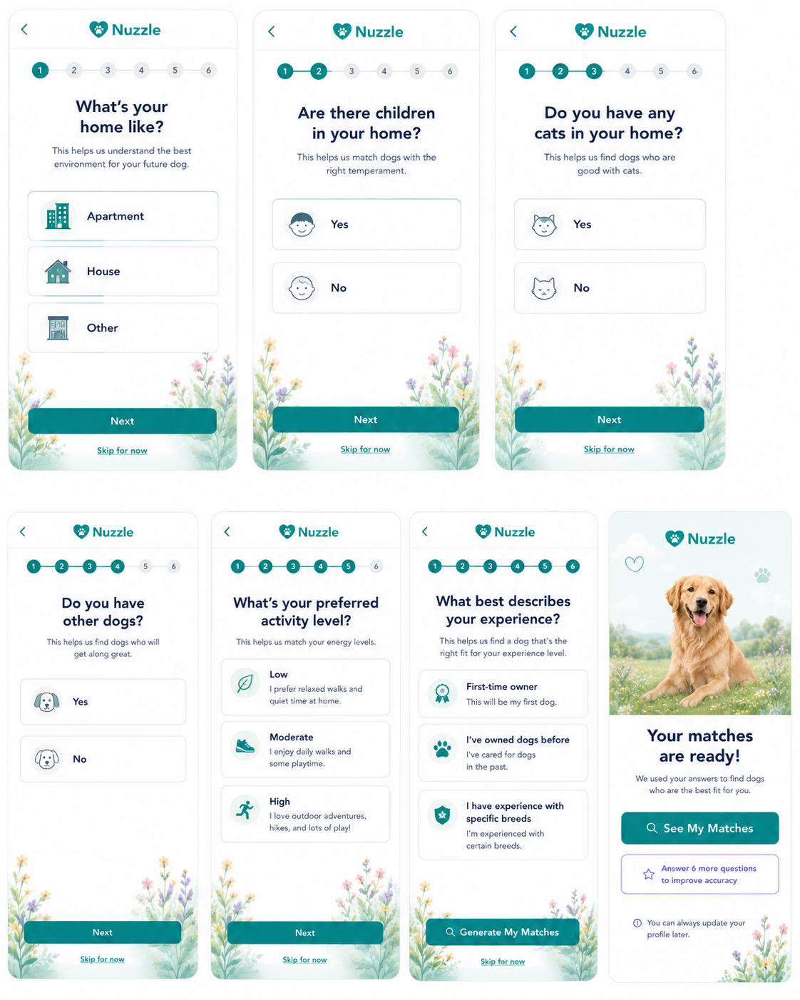

### Overall Layout
- Progress indicator: Dots (not a bar) showing step position — filled dot = current/completed, outlined = remaining
- Nuzzle logo centered in header
- Multiple question cards visible simultaneously (horizontal scroll or multi-card overview on wider screens)

### Question Card Structure
Each card follows an identical visual pattern:
- **Teal header block** (with question icon + question text in white)
- **White body** with interactive answer options (radio buttons, checkboxes)
- **Teal footer** with "Next" button

### Questions Shown (Screen 6)
1. "What's your main lifestyle?" — Apartment / House / Other (with icons)
2. "Are there children in your home?" — Yes / No
3. "Do you have any pets?" — Yes / No / pet type checkboxes
4. "What's your household activity level?" — Low / Moderate / High (with descriptions)

### Design Details
- Large, clear answer options with icons
- Selected state: Teal highlight / filled radio
- Unselected state: Light gray border, empty radio
- Botanical decorative elements at bottom of page

---

## Screen 7: Expanded Questionnaire

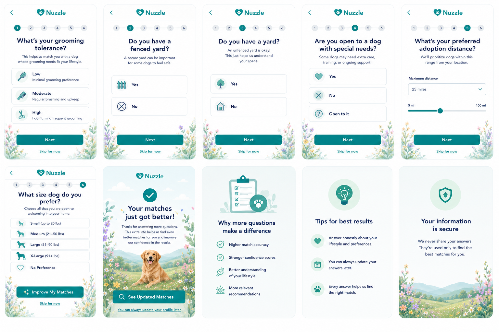

### Layout
- Same card structure and progress dot indicator as Screen 6
- Multiple question cards visible showing the optional improvement phase
- "Why more questions matter?" informational card integrated
- "Your information is secure" privacy reassurance card

### Questions Shown (Screen 7)
1. "What's your grooming preference?" — Low / Medium / High maintenance (with icons)
2. "Do you have a yard?" — Yes / No
3. "Are you open to a dog with unknown history?" — Yes / No / Maybe
4. "Are you new to dog ownership?" — Yes / No
5. "What's your preferred dog size/weight?" — Small / Medium / Large / X-Large (with icons)

### Preview Card
- At end of questionnaire: small preview card "Your matches" with sample dog photos
- "View Matches" CTA button

---

## Screen 8: Match Results

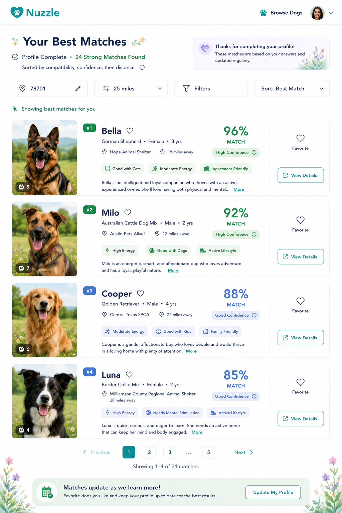

Match Results (Screen 8) shares the same visual layout as Browse Dogs — Authenticated (Screen 3): a two-column card grid with color-coded match badges, confidence labels, and teal CTA buttons. The distinction is context — results are filtered and ranked by the user's compatibility profile rather than a general browse. Refer to the Screen 3 component patterns for implementation.

---

## Screen 9: Account Creation Prompt (Save Favorites Modal)

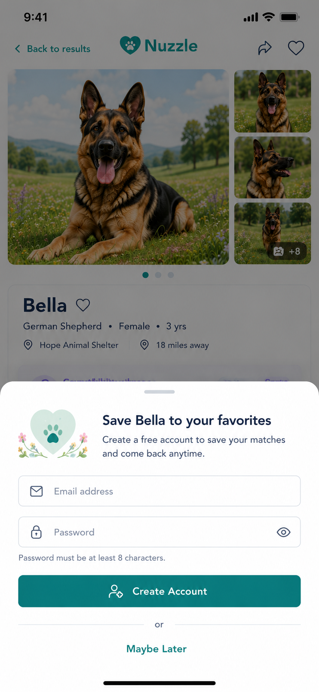

### Presentation
- **Bottom-sheet style on mobile** — slides up from bottom, does not cover full screen
- Dog detail page visible behind with dark semi-transparent overlay
- Rounded top corners on modal card

### Modal Header
- Nuzzle heart-shield logo centered

### Content
- Heading: "Save [Dog Name] to your favorites"
- Subheading: "Create a free account to save your matches"

### Form Fields
- Email input with envelope icon and "Email address" label
- Password input with lock icon and "Password" label
- Password requirement note: "Password must be at least 8 characters"
- Eye icon toggle for show/hide password

### Actions
- **Primary**: Full-width solid teal button — "Create Account"
- **Secondary**: "Maybe Later" text link (smaller, gray, dismisses modal)

### Notes
- Optimized for mobile thumb reach (bottom-anchored)
- Full-width button for easy tap interaction

---

## Screen 10: User Dashboard / Favorites

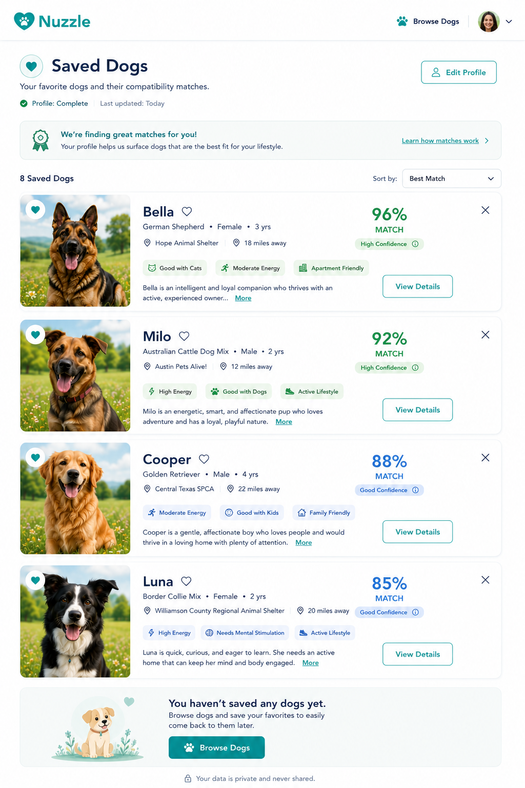

### Layout (Two-Panel)
- **Left sidebar**: User profile summary + navigation menu
  - "Saved Dogs" heading
  - Greeting text
  - Menu: Edit Profile, Saved Dogs (active), Notification Preferences
- **Main content area**: Saved dogs list

### Saved Dogs List
Horizontal-layout cards (stacked vertically), each showing:
- Square thumbnail photo (left)
- Dog name with filled heart icon
- Breed, age, gender, size
- Shelter name with location icon + distance
- Match score badge (color-coded by tier, e.g., "96% MATCH" in green)
- "View Details" button (teal)
- Ellipsis menu (⋯) for additional actions

### Match Score Colors in Dashboard
- 90%+: Bright green badge ("96%", "92%")
- 80%+: Teal/muted green ("88%", "85%")
- 70%+: Orange/amber

### Empty State
- Friendly illustration of a dog
- "You haven't saved any dogs yet"
- "Browse Dogs" teal button

### Footer Navigation
- Bottom tab bar with Home / Browse / Saved / Profile sections
- Active section highlighted in teal

---

## Screen 11: Edit Profile

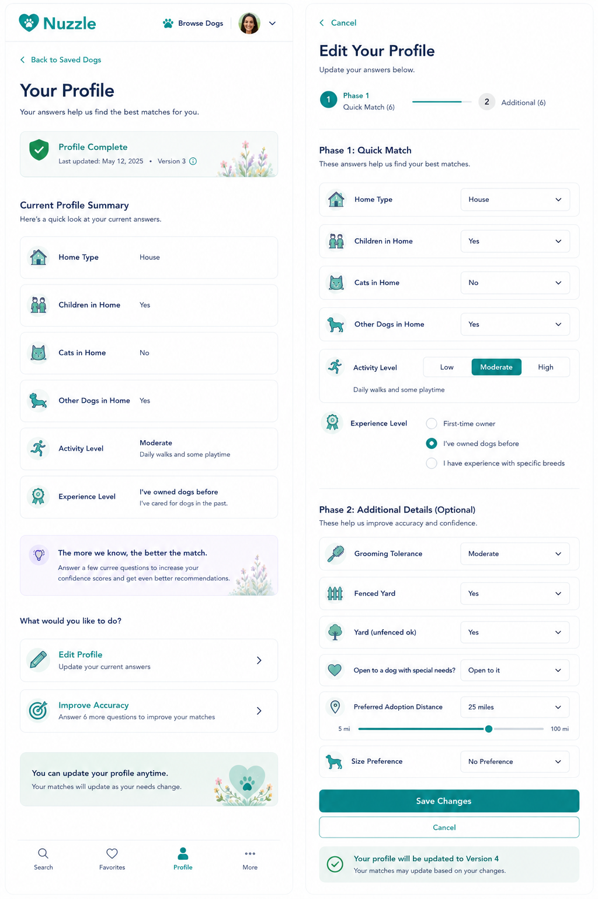

### Layout (Two-Column)
- **Left sidebar**: "Your Profile" read-only summary
  - Profile completion status
  - Current answers listed (lifestyle, children, pets, yard, grooming, etc.)
  - Toggles or checkmarks showing current values
- **Main content**: "Edit Your Profile" multi-section form

### Form Structure
Form is divided into labeled sections, each with a green checkmark when complete:
- **Section 1**: Quick Match fields (home type, children, pets, activity level, experience)
- **Section 2**: Additional details (grooming, yard, special needs willingness)
- **Section 3**: Preferences (size, distance, breed preference)

### Form Components Used
- Text inputs
- Select/dropdown menus
- Checkboxes with labels
- Toggle switches
- Radio buttons for Yes/No questions

### Actions
- "Save Changes" button (teal, prominent at bottom of form)
- Green checkmarks show section completion status

### Footer Navigation
- Bottom nav bar with Profile tab active (teal highlight)

---

## Screen 12: Login

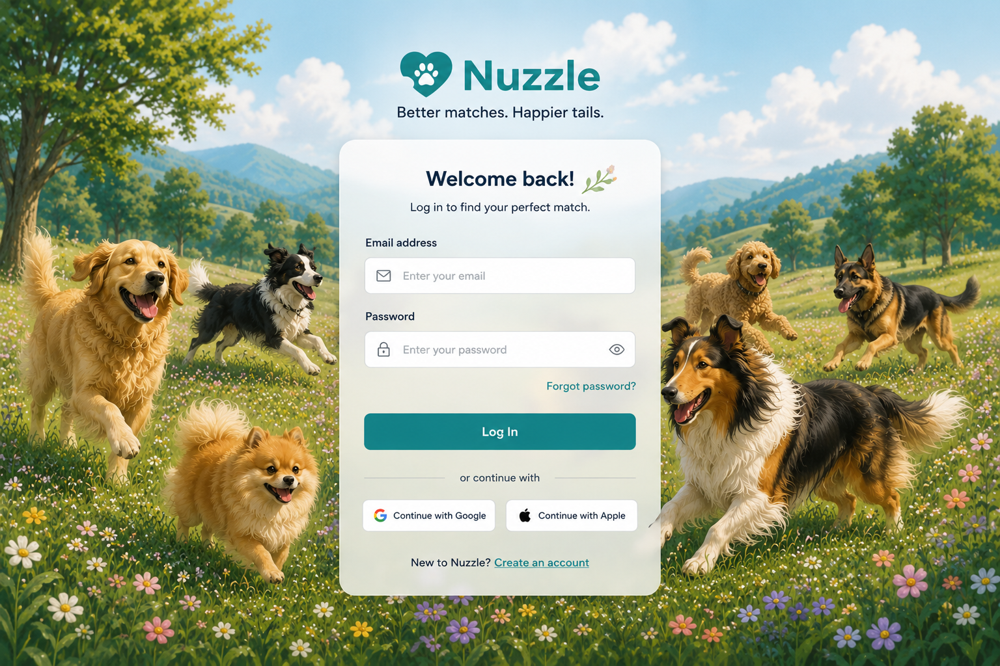

### Shell Layout
- Full-page background: `#F0F8FA`
- Content centered vertically and horizontally
- Clerk `<SignIn />` component centered on the page (no separate logo block — TopNav handles the logo on this page like all other screens)

### Clerk Component Appearance
Customized via the `appearance` prop:
```typescript
{
  variables: {
    colorPrimary: "#20A39E",
    colorBackground: "#FFFFFF",
    borderRadius: "12px",
    fontFamily: "inherit",
  },
}
```
- Primary button, links, and focus rings use teal `#20A39E`
- Card background is white on the `#F0F8FA` page
- Border radius matches the app-wide `~12px` card style
- Font inherits Geist Sans from the root layout

### Responsive
- Desktop: form card `~400px` max-width, centered
- Mobile: card fills width with `16px` horizontal page padding; Clerk's component is responsive by default

### Notes
- No botanical illustrations on this page — keep it clean and focused
- TopNav and BottomTabBar are visible on this page, same as all other screens

---

## Screen 13: Sign Up

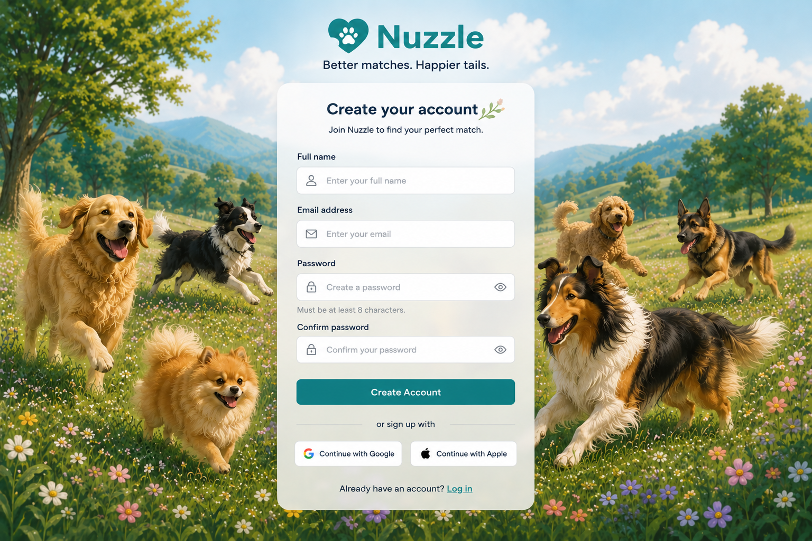

### Shell Layout
Same as Screen 12: `#F0F8FA` background, centered Clerk card. TopNav handles the logo.

Clerk `<SignUp />` component replaces `<SignIn />`.

### Post-Signup Redirect
Users are sent to `/questionnaire` immediately after account creation, so they can build their compatibility profile before browsing.

### Notes
- This is the deliberate signup path for users who click in from the nav. The contextual signup path (Screen 9 modal) is used when a user tries to favorite a dog while anonymous — those two flows are independent and both remain in the design.
- The Clerk component includes a built-in "Already have an account? Log in" link that routes to `/login`.

---

## Component Patterns

### Match Badge (Search Cards, Detail Page, Dashboard)

```
┌────────────────────────┐
│  Strong Match    91%   │  ← color-coded background by tier
└────────────────────────┘
  High Confidence         ← text label, matching tier color
```

Tiers:
- High (80%+): Teal/green background
- Medium (60–79%): Amber/orange background
- Low (<60%): Pink/coral background

Confidence always rendered as text label ("High Confidence", "Medium Confidence", "Low Confidence") — never a raw number.

### Compatibility Teaser (Anonymous Cards + Detail)

```
┌ - - - - - - - - - - - - - - - - ┐
│  🔒 Compatibility Analysis Available    │
│  Create your profile to see:      │
│  ✓ Match Score                    │
│  ✓ Compatibility Explanation      │
│  ✓ Potential Concerns             │
│  ✓ Questions to Ask the Shelter   │
│  [ Get My Compatibility Match ]   │  ← purple filled button
└ - - - - - - - - - - - - - - - - ┘
```

### Questionnaire Answer Card

```
┌──────────────────────────────────────┐  ← teal header
│  [icon]  Question text               │
├──────────────────────────────────────┤  ← white body
│  ○ Option A                          │
│  ○ Option B                          │
│  ● Option C  (selected — teal)       │
├──────────────────────────────────────┤  ← teal footer
│          [ Next ]                    │
└──────────────────────────────────────┘
```

### Primary Button
- Solid teal fill (`primary`)
- White text, semibold
- ~10px border radius
- Full-width on mobile

### Secondary Button (Outlined)
- Teal border, teal text, transparent fill
- Used for secondary page actions (e.g., "Visit Shelter Listing" on anonymous detail page)

### Anonymous CTA Button (Compatibility)
- Solid purple fill (`secondary-cta`)
- White text
- Used exclusively for "Get My Compatibility Match" call-to-action

### Dog Photo Cards
- Square or near-square photo
- Rounded corners (~12px)
- Subtle drop shadow
- Match score badge overlaid top-right (on browse grid) or shown below (on list view)

---

## Botanical Design Theme

Illustrated botanical elements appear throughout the UI as decorative accents. They are purely decorative and must not interfere with interactive content.

**Usage locations:**
- Homepage: Left and right edges of hero section; bottom of page between sections
- Browse pages: Bottom-left and bottom-right corners
- Dog detail page: Bottom-right corner of page
- Questionnaire: Between question cards; at bottom of page

**Illustration style:**
- Hand-drawn / illustrated appearance (not photographic)
- Color palette: Soft pink (#FFB3C6 range) and soft green (#A8D5A2 range)
- Mix of leaves, flowers, and stems
- Used at different scales (large corner accents vs. small inline dividers)

**Implementation note:** These are decorative `` or CSS background images — they must have `aria-hidden="true"` and empty alt text to remain invisible to screen readers.

---

## Navigation

### Bottom Tab Bar (Mobile)

| Tab | Anonymous | Authenticated |
|-----|-----------|--------------|
| Home (house icon) | Visible | Visible |
| Search (magnifier icon) | Visible | Visible |
| Favorites (heart icon) | Triggers account creation prompt | Visible — opens Dashboard |
| Profile (person icon) | Triggers account creation prompt | Visible — opens Edit Profile |

Active tab: Teal fill on icon. Inactive tabs: Gray outline icon.

### Top Nav

| Element | Anonymous | Authenticated |
|---------|-----------|--------------|
| Nuzzle logo + heart-shield | Visible | Visible |
| "Browse Dogs" link | Visible | Visible |
| "Log In" pill button (teal) | Visible | Hidden |
| User avatar (circular) | Hidden | Visible — top right |

---

## Responsive / Mobile-First Guidance

The mockups for Screens 1–5, 9–11 represent **desktop layouts** (~1200–1440px). Screens 6–7 (questionnaire) are already mobile-optimized. All screens must be responsive per RULES.md Rule 12 (mobile-first, 375px baseline). Infer mobile behavior from the desktop mockups as follows:

### Screen 1 — Homepage
- **Hero**: Desktop splits headline/CTAs (left) + dog photo (right). Mobile: Stack vertically — headline → CTAs → dog photo below; photo becomes full-width below the buttons.
- **How It Works**: Desktop 3-column row. Mobile: Stack into a single column (1, 2, 3 vertically).
- **Featured Dogs**: Desktop horizontal carousel. Mobile: Full-width single-card view with swipe or scroll.
- **Profile Prompt Banner**: Full-width at all breakpoints.

### Screen 2 — Browse Anonymous
- **Dog cards**: Desktop 2-column grid. Mobile (375px): Single-column, full-width cards stacked vertically. Tablet (~768px): 2-column grid.
- **Filter controls**: Desktop inline row. Mobile: Collapsed behind a "Filters" button that opens a bottom sheet.
- **Botanical illustrations**: Desktop corners. Mobile: Hide or reduce to a single small accent to preserve content space.

### Screen 3 — Browse Authenticated
- Same responsive rules as Screen 2.
- Match badges must remain fully readable at single-column width; score + label on the same row or stacked (label above, percentage large below).

### Screen 4 — Dog Detail Anonymous
- **Photo + thumbnail gallery**: Desktop shows large photo with thumbnail column on right. Mobile: Full-width hero photo; thumbnail strip becomes a horizontal scroll row below the main photo; dots indicator replaces thumbnails on narrow screens.
- **Info panel**: Stacks naturally to single column on mobile.
- **Compatibility teaser**: Full-width at all sizes.

### Screen 5 — Dog Detail Authenticated
- Same photo collapse as Screen 4.
- **Compatibility card breakdown**: Desktop shows a 3-column layout ("Why This Dog Fits" / "Potential Concerns" / match details). Mobile: Stack all three into a single column, each section as a labeled block.
- **"Before You Apply"**: Collapsible on mobile (open by default), always expanded on desktop.

### Screen 8 — Match Results
- Same responsive rules as Screen 3 (Browse Authenticated) — identical layout.

### Screen 9 — Account Creation Prompt
- Designed as a **bottom sheet / slide-up modal on mobile** (already inferred as mobile-native from the mockup). Desktop: Centered modal overlay, ~480px max-width card.

### Screen 10 — User Dashboard / Favorites
- **Sidebar + main content**: Desktop shows left sidebar (~280px) + main content area. Mobile: Sidebar collapses — navigation becomes a horizontal tab row at top (Saved Dogs | Edit Profile | Settings) or uses the bottom tab bar exclusively.
- **Saved dog cards**: Desktop horizontal layout (photo left, info right). Mobile: Same layout works at single column — photo stays left at ~80px, info text wraps.

### Screen 11 — Edit Profile
- **Two-column layout**: Desktop shows profile summary sidebar (left) + edit form (right). Mobile: Stack vertically — summary panel collapses to a compact banner or accordions above the form.
- Form fields: All inputs naturally go full-width on mobile.

### General Responsive Rules
- Base breakpoints: 375px (mobile), 768px (tablet), 1024px (desktop)
- Botanical corner illustrations: Visible on tablet+, hidden or heavily reduced on mobile to avoid crowding content
- Bottom tab bar: Visible only on mobile (<768px); desktop uses top nav only
- All touch targets: Minimum 44×44px on mobile
- No horizontal scroll on any content at 375px

---

## Notes and Constraints

### App Name
The correct app name is **Nuzzle**. Any UI text or image assets reading "PawMatch" are remnants from an earlier design iteration and must not be used in implementation.

### "Share with Family" Button
A "Share with Family" button appeared in earlier mockups. It is **not specified** in `ux-spec.md`, `wireframe-spec.md`, or `database-api-contract.md`. Do not implement this feature until a story is added to `docs/stories/development-story-pack.md`.

### Questionnaire Question Order
`docs/ux/ux-spec.md` is the source of truth for questionnaire question order (Home Type first, per RULES.md Rule 2). If any mockup image shows a different ordering, the spec takes precedence.

### PII in eventData
No analytics events should include personal information. The `track()` utility in `lib/analytics/track.ts` enforces this at the API level.

---

## References

Read alongside this document:
- `docs/ux/ux-spec.md` — interaction rules, user flows, UX principles (source of truth for behavior)
- `docs/ux/wireframe-spec.md` — screen-by-screen content hierarchy and layout structure
- `docs/ux/wireframe-layouts.md` — detailed ASCII wireframe layouts
