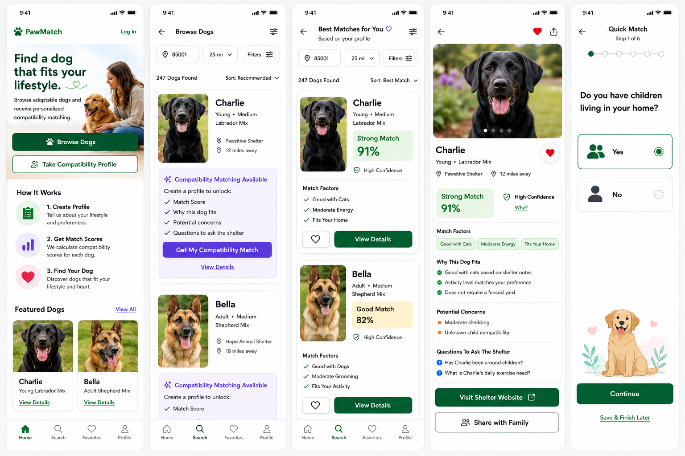
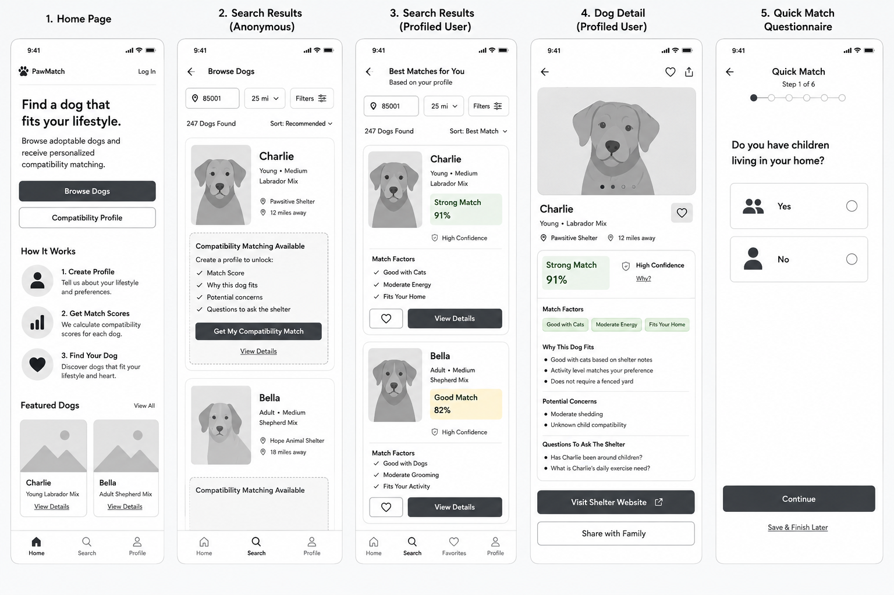

# Visual Design Reference — Nuzzle

Status: Reference only — not a specification

---

## Images

Two mockup images are stored in `docs/ux/mockups/`. Save the files here to resolve the references below.

| File | Contents |
|------|----------|
| `docs/ux/mockups/mockup-color.png` | Full-color high-fidelity mockup (5 screens) |
| `docs/ux/mockups/mockup-wireframe.png` | Labeled grayscale wireframe version (5 screens) |





> **Note on branding**: The mockups display "PawMatch" as the app name. The correct name is **Nuzzle**. All implementation should use "Nuzzle."

---

## Screens Shown

1. Home Page
2. Search Results — Anonymous
3. Search Results — Profiled User
4. Dog Detail — Profiled User
5. Quick Match Questionnaire

---

## Design Tokens (Observed)

These values are inferred from the mockups. Confirm exact hex values before use.

### Colors

| Token | Value (approximate) | Usage |
|-------|-------------------|-------|
| `primary` | Dark green `#1B4332` or similar | Primary buttons, active nav icons, logo |
| `primary-light` | Light green `#D1FAE5` or similar | "Strong Match" badge background |
| `match-strong-text` | Dark green `#065F46` | "Strong Match" label text |
| `match-good-bg` | Amber/yellow `#FEF3C7` | "Good Match" badge background |
| `match-good-text` | Amber `#92400E` | "Good Match" label text |
| `concern-dot` | Orange `#F97316` | Potential concerns bullet indicator |
| `question-dot` | Blue `#3B82F6` | Shelter questions bullet indicator |
| `teaser-cta` | Purple `#7C3AED` | "Get My Compatibility Match" button (anonymous state only) |
| `surface` | White `#FFFFFF` | Card backgrounds, page background |
| `border` | Light gray `#E5E7EB` | Card borders, dividers |
| `text-primary` | Near-black `#111827` | Headlines, dog names |
| `text-secondary` | Gray `#6B7280` | Breed, shelter name, distance |
| `confidence-shield` | Gray `#9CA3AF` | Confidence shield icon |
| `selected-radio` | Dark green (matches primary) | Selected questionnaire option border + radio fill |

### Typography (Observed)

- Headlines ("Find a dog that fits your lifestyle"): Bold, large, tight line-height
- Dog name on card: Semibold, ~18px
- Breed/age on card: Regular, ~13px, secondary color
- Match label ("Strong Match"): Bold, ~15px
- Match percentage ("91%"): Bold, large (~22px), displayed inside the badge
- Section headers ("Match Factors", "Why This Dog Fits"): Semibold, ~14px
- List items (match factors, concerns): Regular, ~14px
- Questionnaire question: Bold, ~20px
- CTA button text: Semibold, all-caps or sentence case

### Spacing and Shape

- Card border radius: ~12px
- CTA button border radius: ~10px (full-width buttons) / ~8px (inline)
- Badge/chip border radius: ~6px (match label badges), ~999px (match factor chips)
- Card padding: ~16px
- Match badge padding: ~8px 12px

---

## Screen 1: Home Page

### Layout
- Top bar: Logo (paw icon + "Nuzzle") left-aligned, "Log In" right-aligned
- Hero: Headline, subheadline, hero image (woman with dog, right side), overlapping layout on larger screens
- Primary CTA: Full-width dark green filled button — "Browse Dogs" with paw icon
- Secondary CTA: Full-width outlined button — "Take Compatibility Profile" with person icon
- "How It Works" section: Three rows, each with an icon, a bold step title, and a 1-line description
- "Featured Dogs" section: "View All" link right-aligned; 2-column grid of dog cards (photo, name, breed, "View Details" link)
- Bottom tab bar: Home (active), Search, Favorites, Profile

### How It Works Icons
- Step 1 (Create Profile): Clipboard/checklist icon, green circle background
- Step 2 (Get Match Scores): Bar chart icon, purple circle background
- Step 3 (Find Your Dog): Heart icon, red circle background

### Featured Dog Cards
- Square photo, dog name bold, breed in secondary text, "View Details" as green underlined link
- No compatibility score shown (anonymous state)

---

## Screen 2: Search Results — Anonymous

### Layout
- Back button "← Browse Dogs" top left, filter icon top right
- Search bar: ZIP code input + radius dropdown ("25 mi") + "Filters" button with icon
- Results count: "247 Dogs Found" + "Sort: Recommended ▾"
- Dog cards (full-width, stacked vertically)
- Bottom tab bar: Search tab active

### Dog Card — Anonymous
- Left column: Square photo (~100px)
- Right column: Dog name (bold large), breed descriptor ("Young • Medium"), breed name, shelter name with pin icon, distance with pin icon
- Below the photo+text row: **Compatibility teaser box** with dashed border
  - Header: "✦ Compatibility Matching Available" (in purple/accent)
  - Body: "Create a profile to unlock:"
  - Checklist: Match Score / Why this dog fits / Potential concerns / Questions to ask the shelter
  - CTA button: Full-width **purple** filled button — "Get My Compatibility Match"
  - Below button: "View Details" as an underlined text link

---

## Screen 3: Search Results — Profiled User

### Layout
- Back button "← Best Matches for You ♡" top left, filter icon top right
- Subheader: "Based on your profile" in secondary color
- Search bar: ZIP + radius + Filters (same as anonymous)
- Sort: "Best Match ▾"
- Results count: "247 Dogs Found"
- Dog cards (full-width, stacked)
- Bottom tab bar: Search tab active, Favorites tab visible (authenticated)

### Dog Card — Profiled
- Left column: Square photo
- Right column:
  - Dog name (bold), breed descriptor, breed
  - **Match badge**: Colored pill — "Strong Match" label + large percentage ("91%") on green background; OR "Good Match" + "82%" on amber background
  - Confidence row: Shield icon + "High Confidence" text (gray)
  - "Match Factors" label
  - Checklist: up to 3 items with green check icons (e.g., Good with Cats / Moderate Energy / Fits Your Home)
- Action row: Heart icon button (outlined) left, "View Details" filled dark button right

---

## Screen 4: Dog Detail — Profiled User

### Layout (scroll order)
1. Back arrow top left; heart icon (filled red = favorited) and share icon top right
2. Full-width dog photo with carousel dots below
3. Dog name (large bold), breed descriptor ("Young • Labrador Mix")
4. Shelter name (pin icon) + Distance (pin icon) — same row
5. Compatibility card (see below)
6. "Match Factors" chips row (horizontal pills: "Good with Cats" · "Moderate Energy" · "Fits Your Home")
7. "Why This Dog Fits" section — bulleted list with green check circles
8. "Potential Concerns" section — bulleted list with orange circle indicators
9. "Questions To Ask The Shelter" section — bulleted list with blue circle question mark indicators
10. "Visit Shelter Website" — dark filled full-width button with external link icon
11. "Share with Family" — outlined full-width button with person+ icon *(unspecced — see note below)*
12. Bottom tab bar

### Compatibility Card
- Green filled pill: "Strong Match" left, "91%" right (large)
- Second row: Shield icon + "High Confidence" + "Why?" (underlined link in secondary color)
- Card has light green background, rounded corners

### "Share with Family" Button
> **Unspecced element**: This button appears in the mockup but is not in `ux-spec.md`, `wireframe-spec.md`, or `database-api-contract.md`. Do not implement until explicitly added to the spec. If this feature is wanted, it needs a story in `docs/stories/development-story-pack.md` and an API endpoint.

---

## Screen 5: Quick Match Questionnaire

### Layout
- Back arrow top left, "Quick Match" title centered, "Step 1 of 6" subtitle
- Progress indicator: 6 dots in a row (first dot filled/dark, rest outlined) — **dot style, not a bar**
- Question text: Bold, large (~20px), centered-left
- Answer options: Full-width cards with icon left, label text, radio button right
  - Selected state: Dark green border, radio filled dark green
  - Unselected state: Light gray border, radio outlined
- "Continue" button: Full-width dark green filled button, bottom of screen
- "Save & Finish Later": Underlined text link below button
- Decorative dog illustration: Bottom right corner (golden retriever with hearts)

### Question Order Note
> **Conflict with ux-spec.md**: The mockup shows Step 1 as "Do you have children living in your home?" but `docs/ux/ux-spec.md` lists Step 1 as "What type of home do you live in?" (Home Type). Resolve this before building the questionnaire. The spec is the source of truth (`RULES.md` Rule 2) unless explicitly overridden.

### Answer Option Anatomy
- Large icon on left (silhouette of people for "Yes", single person silhouette for "No")
- Label text ("Yes" / "No") — bold, ~18px
- Radio circle on right — 24px, dark green when selected

---

## Component Patterns

### Match Badge (Search Card + Detail)
```
┌─────────────────────┐
│  Strong Match  91%  │  ← green background, white or dark text
└─────────────────────┘
  🛡 High Confidence     ← shield icon, gray text, smaller
```

### Match Factor Chips (Detail Page)
```
[ Good with Cats ]  [ Moderate Energy ]  [ Fits Your Home ]
```
Horizontal scroll if overflow. Rounded pill shape. Light green/gray background.

### Compatibility Teaser Box (Anonymous Cards)
```
┌ - - - - - - - - - - - - - - ┐   ← dashed border, light background
  ✦ Compatibility Matching Available   ← accent color (purple)
  Create a profile to unlock:
  ✓ Match Score
  ✓ Why this dog fits
  ✓ Potential concerns
  ✓ Questions to ask the shelter
  [ Get My Compatibility Match ]       ← purple filled button
  View Details                         ← text link
└ - - - - - - - - - - - - - - ┘
```

### Questionnaire Option Card
```
┌─────────────────────────────────────┐
│  [icon]   Label text           ( )  │  ← unselected
└─────────────────────────────────────┘

┌─────────────────────────────────────┐
│  [icon]   Label text           (●)  │  ← selected, green border
└─────────────────────────────────────┘
```

---

## Navigation (Bottom Tab Bar)

| Tab | Icon | Anonymous | Authenticated |
|-----|------|-----------|--------------|
| Home | House | Visible | Visible |
| Search | Magnifier | Visible | Visible |
| Favorites | Heart | Hidden or → account prompt | Visible |
| Profile | Person | Hidden or → account prompt | Visible |

Active tab icon fills with primary green. Inactive icons are gray outline.

---

## References

These mockups should be read alongside:
- `docs/ux/ux-spec.md` — interaction rules and UX principles (source of truth for behavior)
- `docs/ux/wireframe-spec.md` — screen-by-screen content and layout specification
- `docs/ux/wireframe-layouts.md` — ASCII wireframe layouts
